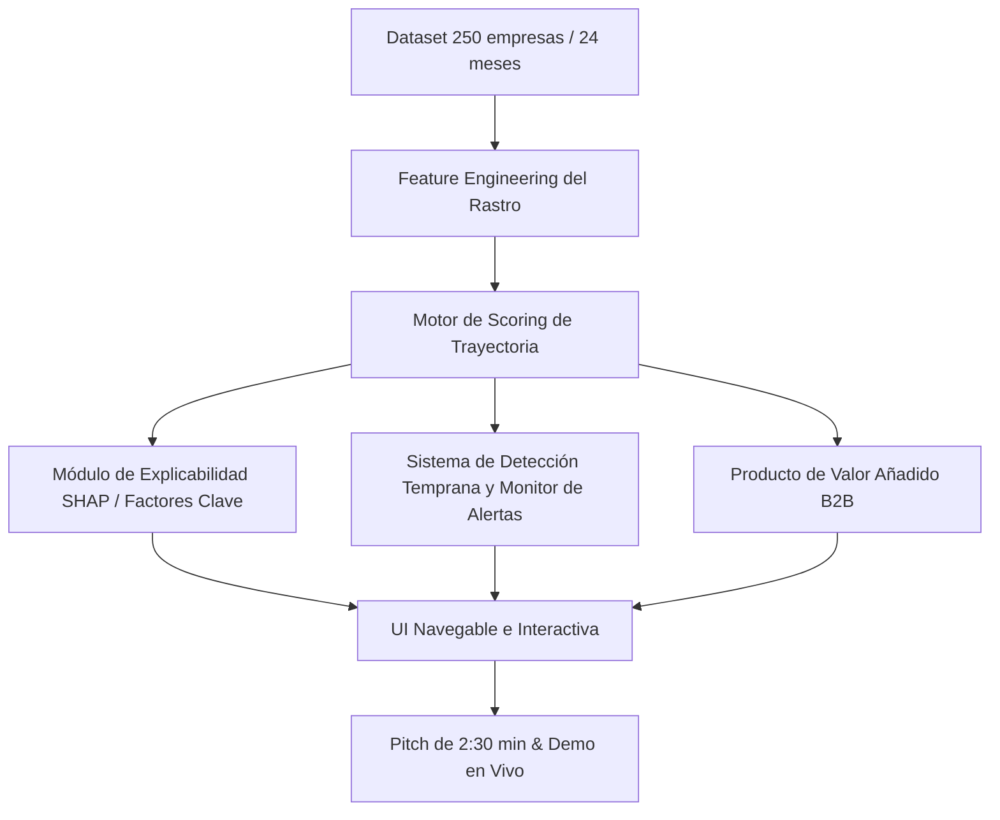

# HackSpain 2026 · X Ray · Reto de Embat
> **Enunciado Oficial del Track: ¿Puede el dinero decir cómo está una empresa?**  
> *18–20 de septiembre, ETSIT UPM, Madrid*

---

## 1. Resumen Ejecutivo del Reto

Os damos el rastro financiero de **250 empresas durante 24 meses**. Con él construís un **score de salud financiera**, y **encima del score, un producto que se le pueda vender a esas mismas empresas**. 

> **El score es el motor. Lo que montéis con él lo elegís vosotros.**

* **Datos:** 250 empresas, 24 meses (septiembre 2024 a septiembre 2026).
* **Test oculto:** 60–80 empresas sin resultado para evaluar en leaderboard.
* **Entrega:** El score + algo vendible encima + demo interactiva navegable.

---

## 2. El Problema: Dos empresas, tres puntos de diferencia

Toda empresa deja un rastro. Entra dinero, se emiten facturas, se paga a proveedores, se cobra de clientes, se dispone y se devuelve deuda. Ese rastro cambia todos los días, pero casi nadie lo lee. Lo que se mira son fotos fijas: cuentas que llegan tarde y ratings que se actualizan cada tanto.

### El Caso Comparativo (24 Meses)
* **Northbrook Foods:** Sube de **45 a 65** (+20 puntos en salud financiera).
* **Velasco Industrial:** Cae de **82 a 68** (-14 puntos en deterioro continuo).

> **La paradoja del mes 24:**  
> En el mes 24 estas dos empresas sacan solo **tres puntos de diferencia** (65 vs 68).  
> **Una es mucho mejor riesgo que la otra**, y en la foto de hoy no se distingue cuál.  
> **Eso es lo que os pedimos que saquéis del rastro.**

---

## 3. Seis preguntas que tiene que contestar vuestro sistema

Esto no va de predecir quiebras. Va de leer el comportamiento financiero en las dos direcciones, y de hacerlo antes de que sea evidente. Estas son las seis preguntas que tiene que contestar el sistema, empresa por empresa y mes a mes:

1. **Quién está sano:** No solo quién está en problemas. Reconocer a una empresa excepcionalmente sólida es tan útil como detectar a la que se hunde.
2. **Quién está mejorando:** Una empresa que pasa de 45 a 65 puede tener números mediocres hoy y ser la mejor apuesta del año que viene.
3. **Quién empieza a torcerse:** De 82 a 68 sigue pareciendo sana. Pero algo en su comportamiento ya ha cambiado y conviene verlo ahora.
4. **Bache o caída:** Un mes malo de caja no es lo mismo que un deterioro estructural. El sistema tiene que saber separarlos.
5. **Por qué ha cambiado:** Un número sin explicación no sirve para decidir. Hace falta saber qué señal se movió y cuándo.
6. **Cuándo se vio venir:** Detectar algo el mes que pasa no vale mucho. La gracia está en cuántos meses antes lo vio el sistema.

---

## 4. Cuatro cosas que tiene que saber hacer el sistema

Las tres primeras construyen el motor. La cuarta es la que convierte el motor en algo que alguien firma.

1. **Leer el rastro:**
   * Movimientos de banco, facturas emitidas y recibidas, comportamiento de pago, coste de financiación y saldos de deuda. 24 meses por empresa.
   * De ahí salen las señales. El trabajo está en decidir cuáles importan.
2. **El score, el eje:**
   * Una puntuación que capte la **trayectoria** y no solo la foto del último mes, y que aguante en las 60–80 empresas que vuestro sistema no ve nunca.
   * Todo lo demás se apoya aquí. Si el número no vale, el producto tampoco.
3. **Explicarse:**
   * Por qué esta empresa saca este número, y por qué ha cambiado desde el mes pasado.
   * *Nadie compra una caja negra para decidir a quién presta o a quién asegura.*
4. **Construir algo encima:**
   * Un producto, un servicio o una herramienta que se apoye en el score y que alguien pagaría por usar.
   * Y saber a quién se lo vendéis. *(Pista: la empresa que os entrega los datos es el comprador más obvio).*

---

## 5. Qué hay en el Dataset

**1.286 empresas sintéticas** agrupadas en **250 grupos empresariales**, con 24 meses de historia cada una (de septiembre de 2024 a septiembre de 2026), en **nueve ficheros CSV** (y JSON). Está generado a partir de la distribución estadística de datos reales de tesorería de pymes: volúmenes, estacionalidad, patrones de contraparte y condiciones de financiación se comportan como los de verdad. *Ninguna fila corresponde a una empresa, una cuenta o una persona real.*

| Fichero | Qué lleva |
| :--- | :--- |
| `groups.csv` | Un grupo empresarial por fila. Un grupo puede ser un holding con varias filiales: de 1 a 24 empresas, mediana 2. |
| `companies.csv` | Una empresa por fila: grupo, país, moneda, ERP y fecha de alta. Su `company_id` es la clave que cruza todos los demás ficheros. |
| `banking_products.csv` | Cuentas bancarias: corriente, tarjeta, TPV, ahorro, inversión y plataforma de gastos, con banco y moneda. |
| `debt_products.csv` | Financiación: préstamos, leasing, líneas de crédito, hipotecas, renting, factoring, confirming y avales. Con importe concedido y saldo pendiente. |
| `debt_schedule_config.csv` | Condiciones de los préstamos con cuadro de amortización: tipo de cuota, frecuencia, número de plazos, tipo de interés y próxima fecha de pago. |
| `transactions.csv` | Movimientos bancarios de los 24 meses: fecha, importe, categoría, estado de conciliación, contraparte y concepto del banco. |
| `invoices.csv` | Facturas sincronizadas del ERP, emitidas y recibidas: emisión, vencimiento, fecha de cobro o pago, importe pendiente, estado y contraparte. |
| `balances.csv` | Saldo de cada cuenta y producto a 1 de septiembre de 2026, la foto final. |
| `data_dictionary.md` | Todos los campos explicados, fichero a fichero. |

---

## 6. Qué tiene que llevar la Entrega

| Qué | Qué significa | Estado |
| :--- | :--- | :--- |
| **Predicción sobre el test oculto** | Vuestro sistema puntúa las empresas que no ha visto nunca. Es lo que entra en el leaderboard. | **Obligatorio** |
| **Señal en las dos direcciones** | Reconoce la mejora igual que el deterioro. Un detector de quiebras a secas se queda corto. | **Obligatorio** |
| **Trayectoria, no foto** | La salida refleja hacia dónde va la empresa, no solo dónde está el último mes. | **Obligatorio** |
| **Explicación** | Para una empresa cualquiera, podéis decir por qué saca ese número y qué lo movió. | **Obligatorio** |
| **Producto encima del score** | Algo construido sobre el número: un marketplace, una póliza, una línea de circulante, un agente. El score solo no es la entrega. | **Obligatorio** |
| **Comprador identificado** | Sabéis decir quién lo paga y por qué le sale a cuenta. No hace falta un plan de negocio, hace falta una respuesta. | **Obligatorio** |
| **Demo navegable** | Algo que se abra y se pruebe delante del jurado. Un notebook que solo corre en vuestro portátil no cuenta. | **Obligatorio** |
| **Anticipación medida** | Enseñáis cuántos meses antes detecta el cambio, no solo que lo detecta. | **Bonus** |
| **Monitor que avisa** | El sistema no espera a que le preguntéis: levanta la mano cuando una empresa se mueve de verdad. | **Bonus** |

---

## 7. Qué se mira (Criterios de Evaluación)

Tres bloques: **si acierta, si llega a tiempo y si vale algo**. Ninguno pesa más que otro.  
*Un modelo sencillo con un producto claro encima nos interesa más que uno sofisticado que se queda en el número.*

### Bloque 1: Si acierta
* **Generalización:** ¿Funciona en las empresas que no ha visto nunca?
* **Trayectoria:** ¿Capta la dirección del movimiento o solo el nivel de hoy?
* **Las dos caras:** ¿Detecta la mejora igual de bien que el deterioro?

### Bloque 2: Si llega a tiempo
* **Anticipación:** ¿Ve el cambio antes de que sea evidente en los números? *Cuántos meses antes, medido.*
* **Estabilidad:** ¿Distingue un bache puntual de un deterioro de verdad?
* **Monitor (Bonus):** Puntos extra si además avisa solo, sin que nadie pregunte.

### Bloque 3: Si vale algo
* **Producto:** ¿Hay algo construido encima del score, o se queda en el número?
* **Comprador:** ¿Sabéis quién lo paga y por qué le sale a cuenta? *La empresa que genera los datos es el candidato obvio.*
* **Explicación:** ¿Se puede contar por qué una empresa saca ese número?
* **Artesanía:** ¿Está bien construido y se nota el cuidado? *Y que la demo se abra y se pruebe.*

---

## 8. Qué se puede vender con esto (Ideas de Producto)

El score es el motor, no el producto. Lo interesante es qué montáis encima y a quién se lo vendéis — y el comprador más evidente es la propia empresa que genera esos datos: ya os los está dando, y es la primera interesada en saber qué dicen de ella. *Son direcciones posibles, no una lista cerrada:*

1. **Marketplace de crédito:**
   * Cruzar empresas que necesitan dinero con quien lo presta, ordenadas por lo que dice su score.
   * El que presta ve riesgo real y actualizado. El que pide deja de mandar el mismo dossier a ocho bancos.
2. **Seguro financiero:**
   * Cobertura sobre el impago de sus clientes, con una prima que se mueve con el score en lugar de revisarse una vez al año.
   * Cuando el cliente se deteriora, la póliza se entera antes que el siniestro.
3. **Financiación de circulante:**
   * Anticipar cobros o estirar pagos con un límite que se recalcula solo, mes a mes.
   * El score dice cuánto, a qué precio y cuándo conviene cerrar el grifo.
4. **Agente de recomendaciones:**
   * Un agente que lee el rastro y dice qué hacer esta semana: renegociar con este proveedor, refinanciar esta deuda, apretar el cobro de estos clientes.
   * Vendido a la empresa sobre sus propios datos.
5. **Predicción por sector:**
   * Agregar los scores por sector y sacar señal de inversión antes de que aparezca en los resultados trimestrales.
   * Aquí el comprador ya no es la empresa, es quien invierte en ella.
6. **Lo que se os ocurra:**
   * Pricing dinámico, scoring de proveedores, un sello que las empresas enseñen para negociar mejor, un comparador de condiciones.
   * *Si hay alguien dispuesto a pagarlo, entra.*

---

## 9. Qué pone Embat (Sponsor)

* **El dataset:** 250 empresas sintéticas con 24 meses cada una, en CSV y JSON, con un diccionario de datos de una página. Todo sintético: aquí no hay ni un dato de producción ni una empresa real.
* **El test oculto, el script de scoring y el leaderboard:** Desde el viernes. Podéis medir cómo vais durante todo el fin de semana en vez de descubrirlo el domingo.
* **El equipo:** Dos ingenieros rotando en el aula todo el fin de semana y un especialista de datos localizable de noche. El sábado por la mañana dan media hora sobre cómo se mueve de verdad el dinero dentro de una empresa: de dónde sale cada fichero y qué significa.
* **Regla de oro de la demo:** *La demo cuenta tanto como el producto.* Por muy buena que sea la señal que encontréis, si en cinco minutos no se ve a quién se le vende y por qué, se queda a medias. Guardad tiempo para ensayar el pitch.

---

## 10. Guía de Trabajo e Iteración para Agentes

Para iterar de forma autónoma y modular sobre este reto:

### Directrices clave para los agentes:
1. **No quedarse en un clasificador binario de quiebra:** El score debe reflejar evolución continua y capturar tanto empresas que mejoran (+20) como las que se deterioran (-14).
2. **Priorizar explicabilidad:** Cada variación en el score debe poder ser desglosada en factores claros (ej: aumento en periodo medio de cobro, tensionamiento de circulante, concentración en contrapartes de riesgo, etc.).
3. **Construir una UI funcional y visualmente pulida:** Imprescindible para la demo ante el jurado (no solo Jupyter Notebooks).
