# Plan de Implementación: Backend Centralizado (DuckDB + FastAPI) para X-Ray
**Proyecto:** X-Ray · Monitor de Salud Financiera y Trayectorias de Caja B2B  
**Hackathon:** HackSpain 2026 · Track Embat (UPM-ETSIT, Madrid)  
**Ubicación:** `.agents/PLAN_BACKEND_DUCKDB_FASTAPI.md`  
**Fecha:** 19 de Septiembre de 2026  
**Estado:** Propuesta de Arquitectura y Plan de Ejecución Inmediata  

---

## 1. Resumen Ejecutivo y Decisión de Arquitectura

Para que la **UI Web (Next.js/React)**, el **Bot de Telegram (@XRAY_EMBA_BOT)** y las **simulaciones del CFO** funcionen de forma fluida, consistente y coordinada, necesitamos una **Fuente Única de Verdad (*Single Source of Truth*)**.

### ¿Por qué DuckDB y NO PostgreSQL / Docker?
1. **Cero fricción de infraestructura:** DuckDB es una base de datos analítica embebida (serveless) en un único archivo local: `xray.duckdb`. No requiere levantar contenedores Docker, configurar puertos, crear usuarios ni pelear con cortafuegos en Mac/Windows.
2. **Velocidad vectorial masiva:** Ingesta los **3,5 millones de registros** (2,5M transacciones + 900k facturas) en **menos de 3 segundos**, permitiendo consultas analíticas de agregación en **2 a 5 milisegundos**.
3. **A prueba de fallos para la demo en vivo (*Zero-Fail Guarantee*):** Al ser un archivo local, si el Wi-Fi del auditorio falla o se satura durante el pitch, todo el sistema (backend, web y bot) sigue respondiendo al 100% en localhost.

---

## 2. Diagrama de Arquitectura del Sistema

```
                  ┌──────────────────────────────────────────────┐
                  │             CSVs Originales Embat            │
                  │ (companies, transactions, invoices, etc.)    │
                  └──────────────────────┬───────────────────────┘
                                         │ Ingesta batch (~3 s)
                                         ▼
                  ┌──────────────────────────────────────────────┐
                  │                 xray.duckdb                  │
                  │         (Base de Datos Centralizada)         │
                  └──────────────┬────────────────┬──────────────┘
                                 │                │
           Lectura / Escritura   │                │ Consultas SQL
                                 ▼                ▼
                  ┌──────────────────────┐ ┌──────────────────────┐
                  │    calc_score.py     │ │       FastAPI        │
                  │  (Motor de Scoring)  │ │   (Servicio API)     │
                  └──────────────────────┘ └──────────┬───────────┘
                                                      │
                            ┌─────────────────────────┴─────────────────────────┐
                            │ JSON API REST                                     │
                            ▼                                                   ▼
             ┌─────────────────────────────┐                     ┌─────────────────────────────┐
             │       Frontend Next.js      │                     │     Telegram Bot (@XRAY)    │
             │   (Dashboard CFO / Cartera) │                     │ (Alertas Push + Interactivo)│
             └─────────────────────────────┘                     └─────────────────────────────┘
```

---

## 3. Modelo de Datos: Esquema de Tablas en `xray.duckdb`

Se estructuran 5 tablas analíticas optimizadas con tipos nativos e índices:

### 3.1. `companies` (Catálogo Corporativo)
```sql
CREATE TABLE companies (
    company_id VARCHAR PRIMARY KEY,
    group_id VARCHAR NOT NULL,
    currency VARCHAR(3) NOT NULL,
    has_erp BOOLEAN NOT NULL DEFAULT FALSE
);
CREATE INDEX idx_companies_group ON companies(group_id);
```

### 3.2. `transactions` (Extractos Bancarios Históricos · 2,55M filas)
```sql
CREATE TABLE transactions (
    transaction_id VARCHAR,
    company_id VARCHAR NOT NULL,
    product_id VARCHAR NOT NULL,
    date DATE NOT NULL,
    amount DOUBLE NOT NULL,
    category VARCHAR NOT NULL,
    status VARCHAR NOT NULL,
    counterparty_id VARCHAR
);
CREATE INDEX idx_trans_company_date ON transactions(company_id, date);
```

### 3.3. `invoices` (Facturación y Documentos ERP · 897k filas)
```sql
CREATE TABLE invoices (
    invoice_id VARCHAR,
    company_id VARCHAR NOT NULL,
    issue_date DATE NOT NULL,
    due_date DATE,
    paid_date DATE,
    total_amount DOUBLE NOT NULL,
    pending_amount DOUBLE NOT NULL,
    status VARCHAR NOT NULL,
    counterparty_id VARCHAR
);
CREATE INDEX idx_invoices_company_due ON invoices(company_id, due_date);
```

### 3.4. `company_scores` (Panel Analítico de Solvencia · 30.864 filas)
Generada directamente por `calc_score.py` (1.286 empresas × 24 meses):
```sql
CREATE TABLE company_scores (
    company_id VARCHAR NOT NULL,
    group_id VARCHAR NOT NULL,
    as_of DATE NOT NULL,
    score DOUBLE NOT NULL,
    base_health DOUBLE NOT NULL,
    state VARCHAR NOT NULL,
    momentum DOUBLE NOT NULL,
    liquidity_points DOUBLE NOT NULL,
    collections_points DOUBLE NOT NULL,
    debt_points DOUBLE NOT NULL,
    momentum_points DOUBLE NOT NULL,
    growth_points DOUBLE NOT NULL,
    fragility_points DOUBLE NOT NULL,
    clipping_points DOUBLE NOT NULL,
    data_confidence_index DOUBLE NOT NULL,
    state_eligible BOOLEAN NOT NULL,
    PRIMARY KEY (company_id, as_of)
);
CREATE INDEX idx_scores_as_of ON company_scores(as_of);
CREATE INDEX idx_scores_state ON company_scores(state);
```

### 3.5. `alerts` (Feed Histórico de Eventos)
```sql
CREATE TABLE alerts (
    alert_id VARCHAR PRIMARY KEY,
    company_id VARCHAR NOT NULL,
    group_id VARCHAR NOT NULL,
    as_of DATE NOT NULL,
    state VARCHAR NOT NULL,
    severity VARCHAR NOT NULL,
    direction VARCHAR NOT NULL,
    score DOUBLE NOT NULL,
    delta_score DOUBLE NOT NULL,
    momentum DOUBLE NOT NULL,
    drivers_json JSON,
    created_at TIMESTAMP DEFAULT CURRENT_TIMESTAMP
);
CREATE INDEX idx_alerts_date ON alerts(as_of);
```

---

## 4. Pipeline de Ingesta (`algorythm/build_duckdb.py`)

Un script idempotente y de ejecución rápida que crea y rellena `xray.duckdb`:

```python
import duckdb
from pathlib import Path

ROOT = Path(__file__).resolve().parents[1]
DB_PATH = ROOT / "xray.duckdb"
DATA_DIR = ROOT / "dataset"
RESULTS_DIR = ROOT / "algorythm" / "engine_results"

def build_database():
    con = duckdb.connect(str(DB_PATH))
    
    # 1. Carga directa de CSVs mediante motor vectorizado de DuckDB
    con.execute(f"""
        CREATE OR REPLACE TABLE companies AS 
        SELECT * FROM read_csv_auto('{DATA_DIR}/companies.csv');
        
        CREATE OR REPLACE TABLE transactions AS 
        SELECT * FROM read_csv_auto('{DATA_DIR}/transactions.csv');
        
        CREATE OR REPLACE TABLE invoices AS 
        SELECT * FROM read_csv_auto('{DATA_DIR}/invoices.csv');
        
        CREATE OR REPLACE TABLE company_scores AS 
        SELECT * FROM read_csv_auto('{RESULTS_DIR}/scores_monthly.csv');
    """)
    
    con.close()
    print("xray.duckdb generado con éxito en <3 segundos.")
```

---

## 5. Contrato de la API REST (FastAPI)

Un microservicio en `backend/main.py` para alimentar el frontend de Next.js y cualquier integración externa:

### 5.1. Endpoints Esenciales

| Método y Ruta | Parámetros | Descripción / Uso en la UI |
|---|---|---|
| `GET /api/companies` | `?state=DETERIORO&min_score=50&group_id=...&limit=50&offset=0` | **Tabla de Cartera del CFO**: lista paginada y filtrable con el último score y estado de cada empresa. |
| `GET /api/companies/{id}` | N/A | **Ficha Ejecutiva**: score actual, grupo, variación 3M, estado, nivel de confianza ($DCI$) y desglose de puntos Waterfall. |
| `GET /api/companies/{id}/history` | `?months=24` | **Gráfica Temporal**: devuelve los 24 meses de score, momentum y estados para renderizar la curva en Recharts. |
| `GET /api/companies/{id}/invoices` | `?status=overdue&limit=20` | **Detalle de Impagos ERP**: lista de facturas vencidas para explicar la causa raíz del estrés comercial. |
| `GET /api/companies/{id}/chart` | N/A | Devuelve la **imagen PNG** de la trayectoria generada por `telegram_charts.py` (ideal para previsualizaciones rápidas). |
| `POST /api/whatif` | Body: `{"company_id": "COMP_0010", "injection_amount": 25000}` | **Simulador Contrafactual**: ejecuta `simulate_whatif()` y devuelve el nuevo score proyectado y producto sugerido. |
| `GET /api/alerts` | `?severity=ALTA&limit=10` | **Campanita de Alertas**: listado de eventos de riesgo emitidos por el monitor. |
| `GET /api/stats` | N/A | **KPIs Globales**: total de empresas analizadas, % en riesgo, volumen en mora y cobertura activa. |

---

## 6. Plan de Ejecución (Sprint de 3 Horas)

```mermaid
gantt
    title Plan de Ejecución: Backend Centralizado
    dateFormat  HH:mm
    axisFormat  %H:%M
    section Ingesta
    Script build_duckdb.py e índices         :done, 00:00, 30m
    section Backend
    Estructura FastAPI y modelos Pydantic    :active, 00:30, 45m
    Endpoints Cartera, Detalle y Gráfica     :01:15, 45m
    Endpoints What-If y Alertas              :02:00, 30m
    section Integración
    Verificación con Frontend y Telegram Bot :02:30, 30m
```



### Paso 1: Script de Ingesta (`algorythm/build_duckdb.py`)
- Crear `xray.duckdb` leyendo directamente `dataset/*.csv` y `engine_results/scores_monthly.csv`.
- Tiempo estimado: **20 minutos**.

### Paso 2: Servicio FastAPI (`backend/main.py`)
- Crear la app FastAPI con middleware CORS habilitado para `localhost:3000` (Next.js).
- Conexión a DuckDB en modo sólo lectura (`read_only=True`) para alta concurrencia.
- Tiempo estimado: **40 minutos**.

### Paso 3: Integración con Frontend y Bot
- El frontend en Next.js hace `fetch("http://localhost:8000/api/companies")`.
- El bot de Telegram puede seguir consultando `score_panels.npz` o leer directamente de DuckDB.
- Tiempo estimado: **30 minutos**.

---

## 7. Comandos de Arranque para los Compañeros

Para que cualquier miembro del equipo levante el backend en su máquina:

```bash
# 1. Instalar dependencias ligeras
pip install duckdb fastapi uvicorn

# 2. Generar o refrescar la base de datos DuckDB
python3 algorythm/build_duckdb.py

# 3. Arrancar la API REST del backend
uvicorn backend.main:app --reload --port 8000

# 4. Verificar la documentación Swagger interactiva
# Abrir en el navegador: http://localhost:8000/docs
```

---
*Documento preparado para el equipo de X-Ray · HackSpain 2026.*
