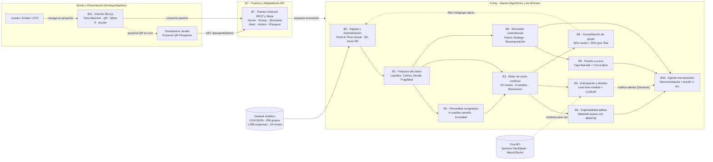

# HackSpain 2026 · Reto Embat (X-Ray)

> **¿Puede el dinero decir cómo está una empresa?**  
> Proyecto desarrollado para el track de **Embat** en **HackSpain 2026** (18–20 de septiembre, ETSIT UPM, Madrid).

---

## Objetivo del Reto
A partir del rastro financiero de **250 empresas durante 24 meses**, construir:
1. **Motor de Score de Salud Financiera:** Capturar la trayectoria continua de la empresa (anticipando mejoras y deterioros en ambas direcciones).
2. **Explicabilidad:** Identificar con claridad los factores y señales causales del cambio de score.
3. **Producto B2B de Valor Añadido:** Solución comercializable basada en el score.
4. **Demo Interactiva:** Aplicación navegable para presentación en vivo ante jurado e inversores.

---

## Equipo
- **[@antoniomachuca](https://github.com/antoniomachuca)**
- **[@carleondel](https://github.com/carleondel)**
- **[@HugoOlivaR](https://github.com/HugoOlivaR)**
- **[@agustmun-web](https://github.com/agustmun-web)**
- **[@Pedrojonfg](https://github.com/Pedrojonfg)**

---

## Estructura del Proyecto
```text
.
├── .agents/                    # Enunciado y requerimientos del track
├── research/
│   ├── algo_research_pedro.md  # Brief del algoritmo: features, nivel, tendencia, estados
│   ├── informe_exploracion.md  # Exploración del dataset (B0): decisiones tomadas con el dato
│   └── *_carlos.md, *_quirce.md # Research de mercado, algoritmos y producto
├── PRODUCTO.md                 # Producto, comprador, arquitectura, reparto y pitch
├── REQUISITOS.md               # Requisitos por bloques de arquitectura (B0–B13) y trazabilidad
├── diagrams/                   # Contexto, paquetes con puertos, clase general y por módulo
├── algorythm/                  # Motor de score, validación y pipeline reproducible
├── README.md
└── .gitignore
```

---

## Por dónde empezar
- **[`PRODUCTO.md`](PRODUCTO.md)** — qué construimos encima del score, a quién se lo
  vendemos, el reparto en 3 ejes y el contrato entre ellos. Empieza por aquí.
- **[`REQUISITOS.md`](REQUISITOS.md)** — la especificación ejecutable: qué construye cada
  bloque (B0–B13), con dueño, contrato, requisitos numerados y criterios de aceptación.
- **[`research/algo_research_pedro.md`](research/algo_research_pedro.md)** — el motor:
  features, percentiles por peer group, nivel, tendencia, estados y explicación.
- **[`research/informe_exploracion.md`](research/informe_exploracion.md)** — lo que dice el
  dataset de verdad: sin target, sin país, sin grafo, y las cuatro piezas que el brief no
  preveía (as-of, signo de factura, saldos reconstruidos, DSCR desde banco).

`PRODUCTO.md` §0 resuelve las discrepancias entre ambos documentos. Ante una duda sobre
el algoritmo manda el brief; sobre producto, comprador o narrativa, manda `PRODUCTO.md`.

---

### Arquitectura del Sistema y Mapa Modular

La arquitectura técnica de **X-Ray** sigue estrictamente el patrón **Hexagonal (Ports & Adapters)** y los principios **SOLID**, desacoplando el núcleo algorítmico y de dominio de los adaptadores de infraestructura y de la interfaz de usuario.

### Vista de Contexto y Flujo Global (C1)



---

### Especificación Detallada por Módulos ([`diagrams/`](diagrams/))

Para garantizar modularidad, legibilidad y rendimiento en los renderizadores, el modelo de clases detallado se encuentra desglosado en diagramas individuales dentro de la carpeta [`diagrams/`](diagrams/):

| Módulo / Vista | Archivo | Responsabilidad / Patrón | Requisitos Clave y Factor WOW |
| :--- | :--- | :--- | :--- |
| **C1 · Contexto** | [`01-contexto.md`](diagrams/01-contexto.md) | Vista global de paquetes, dependencias entrantes y actores | Arquitectura general, integración Exa API |
| **Cx · Puertos API** | [`02-paquetes-puertos.md`](diagrams/02-paquetes-puertos.md) | Mapa operativo de Puertos y Adaptadores (ISP + DIP) | Desacoplamiento REST / Mock determinista |
| **C2 · Clases General** | [`03-diagrama-de-clases-general.md`](diagrams/03-diagrama-de-clases-general.md) | Modelo de dominio completo unificado (B0 a B11) | Fuente de verdad de tipos, métodos y contratos |
| **B0 · Datos e Ingesta** | [`modulo-b0.md`](diagrams/modulo-b0.md) | Ingesta Point-in-Time, saneado de fechas y filtro intragrupo | Cruce 0,0 %, sin lookahead bias en caja |
| **B1 · Features** | [`modulo-b1.md`](diagrams/modulo-b1.md) | Extracción de variables financieras por pilares (`IPilar`) | OCP, DSCR proxy, HHI interno sin grafo |
| **B2 · Percentiles** | [`modulo-b2.md`](diagrams/modulo-b2.md) | Peer groups por cuartil de tamaño y persistencia DIP (`IPercentilStore`) | Inmutabilidad de distribución de train congelada |
| **B3 · Motor de Score** | [`modulo-b3.md`](diagrams/modulo-b3.md) | Puntuación aditiva (24 meses), momentum simétrico y clasificación | 6 estados, Paradoja Northbrook ($45 \to 65$) vs Velasco ($82 \to 68$) |
| **B4 · Explicabilidad** | [`modulo-b4.md`](diagrams/modulo-b4.md) | Descomposición aditiva exacta con residuo de recorte (`deltaClip`) | `sumaCuadra() == 0`, códigos estandarizados `RC_01`–`RC_05` |
| **B5 · Anticipación** | [`modulo-b5.md`](diagrams/modulo-b5.md) | Monitor proactivo (Observer), detector CUSUM y métrica de lead time | Control de falsas alarmas (1 alerta/año), Exa Grounding |
| **B6 · Consolidación** | [`modulo-b6.md`](diagrams/modulo-b6.md) | Agregación holding ($65\%$ media $+ 35\%$ peor filial) | Penalización por contagio ($S_t < 40$), filtro transfer |
| **B7 · Puertos API** | [`modulo-b7.md`](diagrams/modulo-b7.md) | 6 puertos segregados (`IScore`, `IGroup`, `ISimulator`, etc.) | ISP, `APIRestAdapter` (FastAPI), `FixtureOffline` |
| **B8 · Simulador** | [`modulo-b8.md`](diagrams/modulo-b8.md) | Catálogo de 8 palancas financieras (`IPalanca` Strategy) | Contrafactual real (recomputación completa, cero gradientes) |
| **B9 · Puente a Euros** | [`modulo-b9.md`](diagrams/modulo-b9.md) | Caja liberada indiscutible y curva econométrica de tipos | Dos patas separadas y etiquetadas (Aritmética vs Estadística) |
| **B10 · Agente** | [`modulo-b10.md`](diagrams/modulo-b10.md) | Agente transaccional ("el agente no opina, simula") | **Momento WOW 2:** Acción autónoma en 1-clic (`POST /action/generate`) |
| **B11 · Frontend & QR** | [`modulo-b11.md`](diagrams/modulo-b11.md) | Interfaz Next.js: Time-Machine split-screen y Pasaporte Móvil QR | **Momentos WOW 1 y 3:** Split-Screen interactivo y QR móvil en vivo |

---
