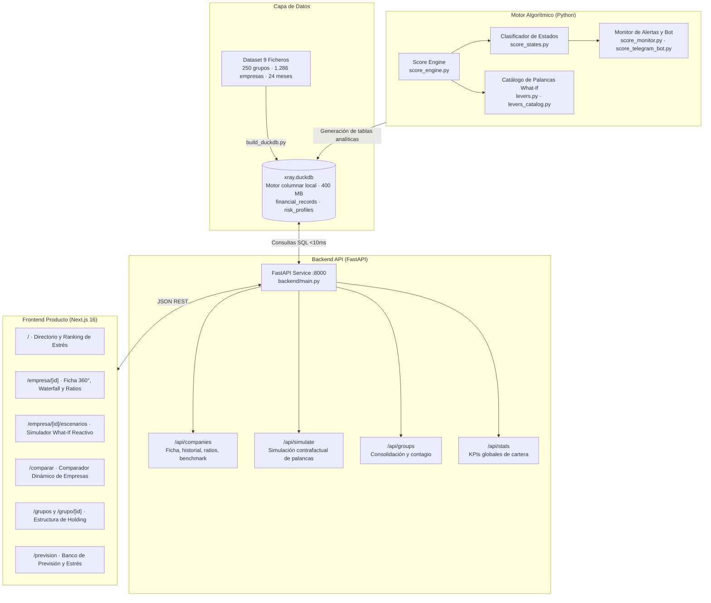

# HackSpain 2026 · Reto Embat (X-Ray)

Sistema de scoring de salud financiera, monitorización de trayectorias de tesorería y simulación contrafactual para empresas a partir de su rastro bancario y de facturación.

Desarrollado para el track de **Embat** en **HackSpain 2026** (18–20 de septiembre de 2026, ETSIT UPM, Madrid).

---

## 1. Enunciado del Track

### Pregunta Central
> **¿Puede el dinero decir cómo está una empresa?**

Los modelos tradicionales de solvencia se basan en balances anuales y ratios contables estáticos que llegan con meses de retraso. Una empresa no quiebra por balance; quiebra por caja. Su operativa diaria deja un rastro continuo: entradas y salidas de cuentas bancarias, emisión y recepción de facturas, calendarios de amortización de deuda y desviaciones en los plazos medios de cobro y pago.

### Datos del Reto
* **Universo:** 250 grupos corporativos y **1.286 empresas** con **24 meses de historial** (septiembre 2024 a septiembre 2026).
* **Fuentes estructuradas:** 9 ficheros que modelan la operativa de tesorería de pymes:
  - `groups.csv`: jerarquías de holdings y filiales (de 1 a 24 empresas por grupo).
  - `companies.csv`: metadatos de empresa (país, divisa base, ERP vinculado, fecha de alta).
  - `banking_products.csv`: cuentas corrientes, ahorro, inversión, tarjetas y TPV.
  - `debt_products.csv` y `debt_schedule_config.csv`: líneas de crédito, préstamos, confirming, leasing y cuadros de amortización.
  - `transactions.csv`: libro de movimientos bancarios con categorización y estado de conciliación.
  - `invoices.csv`: facturas emitidas y recibidas con fechas de vencimiento, cobro/pago e importes pendientes.
  - `balances.csv`: posición de saldos bancarios al corte final (1 de septiembre de 2026).

### El Problema de Referencia: La Paradoja de los Tres Puntos
En el mes 24, dos empresas del dataset presentan una puntuación casi idéntica en una foto fija tradicional:
* **Northbrook Foods:** asciende de **45 a 65** (+20 puntos), consolidando una trayectoria de mejora operativa y reducción de deuda.
* **Velasco Industrial:** cae de **82 a 68** (-14 puntos), con deterioro sistemático de caja y alargamiento de cobros.

Con 65 frente a 68 puntos, una foto fija no distingue qué empresa supone una oportunidad de financiación y cuál un riesgo inminente. El sistema debe leer el rastro temporal continuo para anticipar la dirección antes de que sea evidente.

### Las 6 Preguntas Obligatorias del Reto
1. **Quién está sano:** Identificar solvencia estructural real más allá del saldo puntual de caja.
2. **Quién está mejorando:** Detectar recuperaciones operativas y empresas en trayectoria ascendente.
3. **Quién empieza a torcerse:** Detectar alertas tempranas cuando el score aún parece aceptable (ej. caída desde 82).
4. **Bache o caída:** Diferenciar una tensión puntual de tesorería de un deterioro estructural continuado.
5. **Por qué ha cambiado:** Explicar cada movimiento mediante descomposición causal aditiva exacta.
6. **Cuándo se vio venir:** Medir con cuántos meses de antelación el sistema anticipa el cambio de régimen.

---

## 2. Formulación Matemática del Algoritmo de Scoring

El motor (`algorythm/score_engine.py`) procesa paneles mensuales de cada empresa de forma causal (*point-in-time*, sin sesgo de anticipación ni *lookahead bias*). Genera una puntuación continua $S \in [0, 100]$.

### 2.1. Tres Pilares de Salud Base (0–100)

La salud estructural base pondera tres dimensiones fundamentales:
$$\text{Base} = 100 \cdot (0.50 \cdot L + 0.30 \cdot C + 0.20 \cdot D)$$

#### A. Liquidez ($L$, peso base: 50%)
Mide la holgura del flujo neto trimestral respecto al volumen operativo:
$$m_3 = \frac{R_3 - E_3}{R_3 + E_3} \quad \text{con } R_3 = \sum_{k=0}^{2} R_{t-k}, \; E_3 = \sum_{k=0}^{2} E_{t-k}$$
$$L_{\text{bank}} = 0.5 + 0.5 \cdot \tanh\left(\frac{m_3}{\sigma_L}\right), \quad \sigma_L = 0.50$$

Si se dispone de saldo de caja reconstruido ($C_{\text{caja}}^+$) y compromisos exigibles a 30 días, se combina con el horizonte de supervivencia (*runway*) frente al quemado neto ($\text{burn} = \max((E_3 + H_3 - R_3)/3, 0)$):
$$S_{\text{runway}} = \frac{C_{\text{caja}}^+}{C_{\text{caja}}^+ + 3 \cdot \text{burn}}, \quad S_{\text{cobertura}} = \frac{C_{\text{caja}}^+}{C_{\text{caja}}^+ + \text{obligaciones}_{30d}}$$
$$L = 0.5 \cdot S_{\text{runway}} + 0.5 \cdot S_{\text{cobertura}}$$

#### B. Cobros y Eficiencia ($C$, peso base: 30%)
Evalúa el comportamiento de cobro bancario y la disciplina comercial del ERP:
* **Componente bancario:** penalización por tasa de devoluciones mediante saturación de Hill ($\text{Hill}(x, k) = 1 - \frac{k}{x + k}$) sobre la tasa de devoluciones sobre cobros brutos, combinada con la regularidad de cobros frente a su coeficiente de variación:
  $$C_{\text{bank}} = 0.5 \cdot \left(1 - \text{Hill}\left(\frac{\text{Devoluciones}_3}{\text{CobrosBrutos}_3}, 0.05\right)\right) + 0.5 \cdot \left(\frac{1}{1 + \text{CV}(R_{t-5:t})}\right)$$
* **Componente ERP:** si existe integración contable, incorpora el periodo medio de cobro ($DSO$) y su tendencia trimestral, junto a la fracción de facturación en mora (`late_fraction`):
  $$C_{\text{erp}} = 0.5 \cdot S_{\text{DSO}} + 0.5 \cdot (1 - \text{mora})$$
  $$C = C_{\text{bank}} + w_{\text{erp}} \cdot (C_{\text{erp}} - C_{\text{bank}}), \quad w_{\text{erp}} \le 0.40$$

#### C. Servicio de la Deuda ($D$, peso base: 20%)
Mide la presión de las cuotas de amortización e intereses ($H_3$) respecto a los ingresos operativos:
$$r_{\text{deuda}} = \frac{H_3}{R_3 + H_3}$$
$$D = 0.5 - 0.5 \cdot \tanh\left(\frac{r_{\text{deuda}}}{\sigma_D}\right), \quad \sigma_D = 0.25$$

---

### 2.2. Ajustes Dinámicos y Factores de Fragilidad

Sobre los puntos de la base ($100 \cdot \mathbf{w} \cdot \mathbf{x}$), el motor aplica tres factores de ajuste:

#### 1. Momentum ($M \in [-1, 1]$, escala: $\pm 8.0$ puntos)
Captura la inercia direccional en una ventana de 6 meses mediante dos componentes:
1. **Velocidad:** pendiente de los últimos 3 meses: $v = \frac{\text{Base}_t - \text{Base}_{t-3}}{3}$.
2. **Cruce de medias móviles exponenciales:** diferencia entre media rápida ($\alpha = 0.50$) y lenta ($\alpha = 2/7$): $\Delta_{\text{EMA}} = \text{EMA}_{\text{fast}} - \text{EMA}_{\text{slow}}$.
3. **Filtro de persistencia:** exige que la dirección de cambio se confirme en la mediana de los márgenes mensuales de flujo, eliminando falsos positivos provocados por estacionalidad anual.
$$\text{candidato} = \text{persistencia} \cdot \left(0.5 \cdot \tanh\left(\frac{v}{2.0}\right) + 0.5 \cdot \tanh\left(\frac{\Delta_{\text{EMA}}}{5.0}\right)\right)$$
$$P_{\text{momentum}} = 8.0 \cdot M$$

#### 2. Crecimiento de Calidad ($G \in [0, 1]$, escala: $+6.0$ puntos)
Bonifica el crecimiento de ingresos siempre que esté respaldado por caja real y liquidez operativa, evitando premiar crecimientos descontrolados con tensionamiento de circulante:
$$G = \tanh\left(\frac{\max(\Delta R, 0)}{0.20}\right) \cdot \left(0.5 \cdot (L_{\text{bank}} + C_{\text{bank}})\right) \cdot q_3$$
$$P_{\text{crecimiento}} = +6.0 \cdot G$$

#### 3. Fragilidad Financiera ($F \in [0, 1]$, penalización: $-8.0$ puntos)
Evalúa vulnerabilidades estructurales ocultas:
* Tensión por desajustes temporales de tesorería (`funding_gap` relativo a gastos).
* Porcentaje del mes con saldo bancario negativo (descubierto).
* Tensión de impagos en ERP.
* Concentración comercial mediante el índice Herfindahl-Hirschman ($HHI$) sobre clientes o contrapartes.
$$P_{\text{fragilidad}} = -8.0 \cdot F$$

---

### 2.3. Puntuación Final y Explicabilidad Exacta

El score bruto suma los 6 sumandos:
$$S_{\text{raw}} = \underbrace{50 \cdot L + 30 \cdot C + 20 \cdot D}_{\text{Salud Base}} + \underbrace{8.0 \cdot M}_{\text{Momentum}} + \underbrace{6.0 \cdot G}_{\text{Crecimiento}} - \underbrace{8.0 \cdot F}_{\text{Fragilidad}}$$
$$S = \text{clip}(S_{\text{raw}}, 0, 100)$$

#### Descomposición Aditiva Exacta (Waterfall)
Para cualquier intervalo temporal o simulación contrafactual, el cambio en el score se descompone de forma exacta y sin residuo:
$$\Delta S = \Delta P_L + \Delta P_C + \Delta P_D + \Delta P_M + \Delta P_G + \Delta P_F + \Delta P_{\text{clip}}$$
No hay aproximaciones tipo caja negra; cada punto ganado o perdido tiene un origen contable identificable.

#### Índice de Confianza del Dato
Refleja la madurez del histórico observable ($t \ge 6$ meses para estabilizar momentum) y la calidad de conciliación bancaria y contable:
$$\text{Confianza} = \text{clip}\left(100 \cdot q_3 \cdot \min\left(\frac{t_{\text{observados}}}{6}, 1.0\right), 0, 100\right)$$

---

### 2.4. Máquina de 6 Estados Analíticos

El clasificador (`algorythm/score_states.py`) asigna a cada empresa en cada mes un estado que responde a las preguntas del reto:

| Estado | Condición Clave | Significado Financiero |
| :--- | :--- | :--- |
| `ESTABLE` | $\|M\| \le 0.10$ | Fluctuaciones ordinarias sin inercia direccional sostenida. |
| `TORCIENDOSE` | $\text{Base} \ge 60$ y $M < -0.10$ durante $\ge 3$ meses | **Alerta temprana:** la empresa parece sana hoy, pero acumula 3 meses de deterioro estructural. |
| `DETERIORO` | $\text{Base} < 60$ y $M < -0.10$ durante $\ge 3$ meses | Deterioro severo sobre una posición financiera ya debilitada. |
| `MEJORANDO` | $M > +0.10$ durante $\ge 3$ meses sin debilidad previa | Trayectoria ascendente confirmada en empresa solvente. |
| `RECUPERACION` | $M > +0.10$ durante $\ge 3$ meses con debilidad previa | **Caso Northbrook:** empresa saliendo de zona de riesgo con fundamentales crecientes. |
| `BACHE` | Caída puntual en margen $> 0.12$ sin momentum previo | **Filtro de ruido:** tensión puntual de caja aislada; no es cambio de tendencia. |
| `EVALUACION_PENDIENTE` | Histórico $< 6$ meses o cobertura insuficiente | Período de warmup; se abstiene de diagnosticar sin suficiente señal. |

---

### 2.5. Consolidación de Grupo y Riesgo de Contagio

En holdings (`algorythm/build_duckdb.py`, `backend/routes/companies.py`), el score consolidado del grupo combina la media ponderada por volumen con la situación de la filial más débil:
$$S_{\text{grupo}} = 0.65 \cdot \bar{S}_{\text{filiales}} + 0.35 \cdot \min(S_{\text{filiales}})$$
Si cualquier filial desciende a zona crítica ($S < 40$), se aplica una penalización adicional por **riesgo de contagio intragrupo** proporcional al peso de pasivos y tensionamiento entre partes vinculadas.

---

## 3. Arquitectura del Sistema

El sistema está organizado en capas desacopladas, utilizando una base de datos columnar como fuente única de verdad para el backend y frontend:



### Componentes y Tecnologías

1. **DuckDB (`xray.duckdb`):**
   - Almacén de datos analítico local embebido.
   - Indexa y procesa 30.000+ cortes mensuales de empresas, ratios de circulante (DSO, DPO, días de caja, facturación) y precomputaciones de escenarios what-if con tiempos de respuesta inferiores a 10 ms sin infraestructura externa.

2. **Backend FastAPI (`backend/`):**
   - Framework REST asíncrono en Python 3 con validación de esquemas vía Pydantic v2.
   - Endpoints principales:
     - `GET /api/companies`: listado paginado y ordenación por score, estado o volumen.
     - `GET /api/companies/rankings`: empresas con mayor estrés o mayor mejora.
     - `GET /api/companies/{id}`: detalle completo de empresa (score actual, estado analítico oficial, desglose de factores).
     - `GET /api/companies/{id}/history`: serie temporal de 24 meses (score, liquidez, cobros, deuda).
     - `GET /api/companies/{id}/operational-metrics`: ratios reales calculados (DSO, DPO, facturación anual, días de caja).
     - `GET /api/companies/{id}/benchmark`: posición percentil frente a empresas de su mismo sector y tamaño.
     - `POST /api/simulate`: recomputación contrafactual completa aplicando variaciones en días de cobro, pago o inyecciones de tesorería.
     - `GET /api/groups` y `GET /api/groups/{id}`: métricas consolidadas de grupo y penalización por contagio.
     - `GET /api/stats`: distribución global de la cartera (empresas sólidas, intermedias, débiles).

3. **Frontend Next.js (`front/`):**
   - Construido con Next.js 16 (App Router), TypeScript y Tailwind CSS.
   - Interfaz orientada al director financiero (CFO) y analista de crédito:
     - **Dashboard General (`/`):** monitorización del universo de empresas, alertas activas y rankings de variación.
     - **Ficha de Empresa (`/empresa/[id]`):** velocímetro de score, anillo de estado analítico oficial (`MEJORANDO`, `TORCIENDOSE`, etc.), gráfico *waterfall* con diagnósticos causales específicos por factor, ratios de tesorería y posición en la curva de pares.
     - **Simulador What-If (`/empresa/[id]/escenarios`):** sliders interactivos que invocan el motor contrafactual y ordenan las palancas por impacto en puntos de score y euros de liquidez liberada.
     - **Comparador (`/comparar`):** análisis lado a lado de dos empresas para contrastar trayectorias contrapuestas (ej. Northbrook vs Velasco).
     - **Ficha de Grupo (`/grupo/[id]`):** mapa de filiales con detección de filiales críticas que penalizan la salud del holding.

4. **Laboratorio de Previsión y Escenarios de Estrés (`forecasting/`):**
   - Banco de pruebas con evaluación cuantitativa de modelos a horizontes de 1, 3 y 6 meses.
   - Modelos probados: regresión Huber robusta, lineal por mediana, media reciente, regularización Ridge con validación cruzada por grupos (`GroupKFold`), y modelo estructural (`structural_v2`) que proyecta componentes de balance y flujos para aplicar directamente la fórmula de scoring.
   - 19 escenarios de estrés sistemáticos (baches temporales, pérdida de clientes, subida de costes, contagio intragrupo).

5. **Monitor Proactivo de Tesorería (`algorythm/score_monitor.py`):**
   - Detección automática de transiciones de régimen y bot de Telegram integrado para notificaciones inmediatas con desglose aditivo del motivo del cambio.

---

## 4. Estructura del Repositorio

```text
.
├── algorythm/                  # Núcleo del motor algorítmico
│   ├── score_engine.py         # Fórmula continua de scoring (L, C, D, M, G, F)
│   ├── score_states.py         # Clasificador en 6 estados analíticos y filtro de ruido
│   ├── levers.py               # Motor de simulación contrafactual
│   ├── levers_catalog.py       # Catálogo de palancas operativas y financieras
│   ├── score_monitor.py        # Generador de alertas causales y lead time
│   ├── score_telegram_bot.py   # Bot de notificaciones en Telegram
│   └── build_duckdb.py         # Pipeline de ingesta hacia DuckDB
├── backend/                    # Capa de servicios REST (FastAPI)
│   ├── main.py                 # Punto de entrada de la API y registro de routers
│   ├── database.py             # Conexión optimizada de sólo lectura a DuckDB
│   ├── schemas.py              # Modelos de datos Pydantic v2
│   ├── routes/                 # Endpoints (companies, simulate, groups, stats, etc.)
│   └── test_backend.py         # Suite de pruebas automatizadas con Pytest
├── front/                      # Aplicación web de producto (Next.js 16)
│   ├── app/                    # Rutas de Next.js (/, /empresa, /comparar, /grupos, etc.)
│   ├── components/             # Componentes de UI (anillos, waterfalls, gráficos)
│   └── lib/                    # Clientes de API y utilidades
├── forecasting/                # Laboratorio de modelos predictivos y benchmarks
│   ├── benchmark.py            # Evaluador de modelos a 1, 3 y 6 meses
│   ├── structural.py           # Modelo predictivo estructural (proyección de componentes)
│   ├── benchmarks/             # Leaderboard, métricas e informes de contraste
│   └── tests/                  # Pruebas de modelos y validación
├── dataset/                    # Diccionario de datos y utilidades de parsing
├── xray.duckdb                 # Base de datos columnar con los 24 meses procesados
└── requirements.txt            # Dependencias de Python
```

---

## 5. Guía de Puesta en Marcha (Quickstart)

### Requisitos Previos
* **Python 3.11 o 3.12**
* **Node.js 18+** y `npm`

### 1. Configuración del Entorno Python
```bash
# Crear y activar entorno virtual
python3 -m venv .venv
source .venv/bin/activate

# Instalar dependencias
pip install -r requirements.txt
```

### 2. Ejecución de Tests
```bash
# Tests de la API backend y consistencia de datos (20 tests)
PYTHONPATH=. pytest backend/

# Tests del motor algorítmico y palancas
python -m unittest discover -s algorythm -p "test_*.py"
```

### 3. Levantar el Backend (FastAPI)
```bash
uvicorn backend.main:app --reload --port 8000
```
La documentación interactiva OpenAPI/Swagger queda disponible en: `http://localhost:8000/docs`

### 4. Levantar el Frontend (Next.js)
En una segunda terminal:
```bash
cd front
npm install
npm run dev
```
La aplicación queda accesible en: `http://localhost:3000`

---

## 6. Verificación de Integración

* **Build del Frontend:** `npm --prefix front run build` compila con cero advertencias y tipado estricto en TypeScript.
* **Backend:** 20/20 tests pasando en `backend/test_backend.py` cubriendo endpoints de empresas, histórico, métricas operativas (DSO/DPO), benchmarking sectorial, simulación what-if y consolidación de grupos.
