# HackSpain 2026 · Reto Embat (X-Ray)

> **¿Puede el dinero decir cómo está una empresa?**  
> Proyecto desarrollado para el track de **Embat** en **HackSpain 2026** (18–20 de septiembre, ETSIT UPM, Madrid).

---

> ⭐ **El documento maestro del producto es [`PRODUCTO-MAESTRO.md`](PRODUCTO-MAESTRO.md)**
> (acordado por el equipo el 19-sep-2026). Prevalece sobre el resto de documentos.

---

## 🎯 Objetivo del Reto
A partir del rastro financiero de **250 empresas durante 24 meses**, construir:
1. **Motor de Score de Salud Financiera:** Capturar la trayectoria continua de la empresa (anticipando mejoras y deterioros en ambas direcciones).
2. **Explicabilidad:** Identificar con claridad los factores y señales causales del cambio de score.
3. **Producto B2B de Valor Añadido:** Solución comercializable basada en el score.
4. **Demo Interactiva:** Aplicación navegable para presentación en vivo ante jurado e inversores.

---

## 👥 Equipo
- **[@antoniomachuca](https://github.com/antoniomachuca)**
- **[@carleondel](https://github.com/carleondel)**
- **[@HugoOlivaR](https://github.com/HugoOlivaR)**
- **[@agustmun-web](https://github.com/agustmun-web)**
- **[@Pedrojonfg](https://github.com/Pedrojonfg)**

---

## 📂 Estructura del Proyecto
```text
.
├── .agents/                    # Enunciado y requerimientos del track
├── research/
│   ├── algo_research_pedro.md  # Brief del algoritmo: features, nivel, tendencia, estados
│   ├── informe_exploracion.md  # Exploración del dataset (B0): decisiones tomadas con el dato
│   └── *_carlos.md, *_quirce.md # Research de mercado, algoritmos y producto
├── PRODUCTO-MAESTRO.md         # ⭐ Documento maestro del producto: las 6 preguntas y las 3 pantallas
├── front/                      # Front de producto (Next.js) que implementa el maestro
├── PRODUCTO.md                 # Producto, comprador, arquitectura, reparto y pitch
├── REQUISITOS.md               # Requisitos por bloques de arquitectura (B0–B13) y trazabilidad
├── README.md
└── .gitignore
```

---

## 📖 Por dónde empezar
- **[`PRODUCTO.md`](PRODUCTO.md)** — qué construimos encima del score, a quién se lo
  vendemos, el reparto en 3 ejes y el contrato entre ellos. Empieza por aquí.
- **[`REQUISITOS.md`](REQUISITOS.md)** — la especificación ejecutable: qué construye cada
  bloque (B0–B13), con dueño, contrato, requisitos numerados y criterios de aceptación.
- **[`research/algo_research_pedro.md`](research/algo_research_pedro.md)** — el motor:
  features, percentiles por peer group, nivel, tendencia, estados y explicación.
- **[`research/informe_exploracion.md`](research/informe_exploracion.md)** — lo que dice el
  dataset de verdad: sin target, sin país, sin grafo, y las cuatro piezas que el brief no
  preveía (as-of, signo de factura, saldos reconstruidos, DSCR desde banco).

`PRODUCTO.md` §0 resuelve las discrepancias entre ambos documentos. Ante una duda sobre
el algoritmo manda el brief; sobre producto, comprador o narrativa, manda `PRODUCTO.md`.

---

## 🧩 Diagrama de clases

Modelo de dominio derivado de [`REQUISITOS.md`](REQUISITOS.md), agrupado por bloque de
arquitectura (B0–B10). B11–B13 (front, pitch, entrega) no aparecen porque son consumidores
de `ServicioAPI`, no dominio. Los nombres del contrato de B7 van sin acentos por
compatibilidad con Mermaid.

```mermaid
classDiagram
direction LR

%% ═══════════════ B0 · Datos (dataset sintético) ═══════════════
namespace B0_Datos {
  class Grupo {
    +String group_id
    +String erp
    +int n_companies_in_sample
  }
  class Empresa {
    +String company_id
    +String group_id
    +String country
    +String currency
    +String erp
    +Date created_at
  }
  class Producto {
    <<abstract>>
    +String product_id
    +String company_id
    +String label
    +String type
    +String bank_name
    +String service
    +String currency
    +Date created_at
  }
  class ProductoBancario {
    +TipoBancario type
  }
  class ProductoDeuda {
    +TipoDeuda type
    +Decimal granted
    +Decimal outstanding
    +Decimal liquidity
  }
  class CuadroAmortizacion {
    +String product_id
    +String settlement_product_id
    +String amortization_type
    +String interest_calc_method
    +String amortising_frequency
    +String interest_type
    +Decimal granted_balance
    +Decimal outstanding_balance
    +int total_periods
    +Date next_payment_date
    +Date last_payment_date
    +Decimal annual_interest_rate_or_spread
    +cuotaAnual() Decimal
  }
  class Transaccion {
    +String transaction_id
    +String company_id
    +String product_id
    +Date date
    +Date value_date
    +Decimal amount
    +Decimal exchange_rate
    +String status
    +String accounting_status
    +String category
    +String description
    +String counterparty_id
    +esIntragrupo() bool
    +esFinanciacion() bool
  }
  class Factura {
    +String operation_id
    +String company_id
    +String document_type
    +Date issuance_date
    +Date due_date
    +Date payment_date
    +Decimal amount
    +Decimal pending_amount
    +String currency
    +String status
    +String counterparty_id
    +esEmitida() bool
    +esRecibida() bool
    +diasRetrasoSobreVencimiento() int
  }
  class Saldo {
    +String product_id
    +String company_id
    +Date date
    +Decimal balance
    +Decimal available
    +Decimal granted
    +Decimal liquidity
  }
  class Contraparte {
    +String counterparty_id
    +String company_id_cruzado
  }
  class CalendarioCanonico {
    +Date inicio
    +Date fin
    +List~Mes~ meses
    +mesesSinMovimientoACero()
  }
  class CargadorDataset {
    +cargar(rutas) Tablas
    +validarIntegridadReferencial() bool
    +normalizarSigno()
    +convertirAEUR()
    +informeExploracion() InformeExploracion
  }
  class TipoBancario {
    <<enumeration>>
    checking
    card
    investment
    tpv
    saving
    expensesPlatform
  }
  class TipoDeuda {
    <<enumeration>>
    loan
    leasing
    lineofcredit
    mortgage
    renting
    factoring
    confirming
    guarantee
  }
}

%% ═══════════════ B1 · Features del rastro ═══════════════
namespace B1_Features {
  class BloqueFeature {
    <<enumeration>>
    LIQUIDEZ
    PAGO
    DEUDA
    CONCENTRACION
  }
  class Direccion {
    <<enumeration>>
    MAYOR_MEJOR
    MAYOR_PEOR
  }
  class DefinicionFeature {
    +String nombre
    +BloqueFeature bloque
    +Direccion direccion
    +float peso_interno
    +String unidad_negocio
  }
  class ValorFeature {
    +String company_id
    +Mes mes
    +String feature
    +Decimal valor
    +bool imputado
    +int meses_ventana
  }
  class InsumosConfianza {
    +float pct_conciliado
    +int meses_historia
    +float cobertura_productos
    +float match_factura_banco
  }
  class PipelineFeatures {
    +int ventana_meses
    +int minimo_meses
    +calcular(Tablas, CalendarioCanonico) List~ValorFeature~
    +recomputar(Tablas modificadas) List~ValorFeature~
    +eliminarIntragrupo(Tablas) Tablas
    +imputarNulos(PeerGroup)
    +dscrProxy(company_id, mes) Decimal
  }
}

%% ═══════════════ B2 · Peer groups y percentiles congelados ═══════════════
namespace B2_Peer {
  class NivelShrinkage {
    <<enumeration>>
    LOCAL
    MEZCLA
    PEER_LIMITADO
    GLOBAL
  }
  class PeerGroup {
    +String peer_id
    +String pais
    +int cuartil_ingresos
    +int n_empresas
    +NivelShrinkage shrinkage
    +float w
  }
  class TablaPercentiles {
    +String version
    +List~Decil~ deciles
    +construir(features_train) TablaPercentiles
    +percentil(feature, valor, peer) float
    +serializar(ruta)
    +cargar(ruta) TablaPercentiles
  }
  class Percentil {
    +String company_id
    +Mes mes
    +String feature
    +float p_peer
    +bool saturado
    +bool peer_desconocido
  }
}

%% ═══════════════ B3 · Motor de score ═══════════════
namespace B3_Score {
  class Estado {
    <<enumeration>>
    MEJORANDO
    ESTABLE
    TORCIENDOSE
    DETERIORO
    BACHE
    RECUPERACION
  }
  class Semaforo {
    <<enumeration>>
    ALTA
    MEDIA
    BAJA
  }
  class ConfiguracionScore {
    +String version
    +Map~BloqueFeature,float~ pesos_bloque
    +Map~String,float~ pesos_internos
    +float k
    +UmbralesEstado umbrales
    +int meses_tendencia
    +cargar(ruta) ConfiguracionScore
  }
  class UmbralesEstado {
    +float t_umbral
    +int persistencia_meses
    +float n_frontera
    +float caida_bache
    +float recuperacion_bache
  }
  class Confianza {
    +float valor
    +Semaforo semaforo
    +bool peer_limitado
  }
  class ScoreMensual {
    +String company_id
    +Mes mes
    +float score
    +float nivel
    +float tendencia
    +Estado estado
    +Confianza confianza
    +Map~BloqueFeature,float~ percentil_bloque
  }
  class Trayectoria {
    +String company_id
    +List~ScoreMensual~ puntos
    +serieNivel() List~float~
    +serieTendencia() List~float~
  }
  class MotorScore {
    +calcularNivel(percentiles) float
    +calcularTendencia(serie_N) float
    +clasificarEstado(historia_N, historia_T) Estado
    +calcularScore(N, T) float
    +calcularConfianza(InsumosConfianza) Confianza
    +puntuar(company_id, mes) ScoreMensual
    +trayectoria(company_id) Trayectoria
  }
}

%% ═══════════════ B4 · Explicabilidad ═══════════════
namespace B4_Explicacion {
  class CodigoRazon {
    <<enumeration>>
    RC_01_FLUJO_INSUFICIENTE
    RC_02_DETERIORO_COBROS
    RC_03_CARGA_FINANCIERA
    RC_04_CONCENTRACION_INGRESOS
    RC_05_CONFIANZA_LIMITADA
  }
  class Driver {
    +String feature
    +BloqueFeature bloque
    +float contribucion
    +Decimal valor
    +float p_peer
    +String unidad
  }
  class Explicacion {
    +float delta_score
    +List~Driver~ drivers
    +List~CodigoRazon~ codigos_razon
    +String frase
    +sumaCuadra() bool
  }
  class Explicador {
    +porQueEsteNumero(ScoreMensual) List~CodigoRazon~
    +porQueHaCambiado(ScoreMensual t, ScoreMensual t_1) List~Driver~
    +fraseLegible(Explicacion) String
  }
}

%% ═══════════════ B5 · Anticipación y monitor ═══════════════
namespace B5_Anticipacion {
  class Severidad {
    <<enumeration>>
    ALTA
    MEDIA
    BAJA
  }
  class DetectorCambioRegimen {
    +cusum(serie_cruda) Mes
  }
  class MetricaAnticipacion {
    +float mediana_meses
    +float tasa_falsas_alarmas
    +calcular(Trayectorias, cambios_regimen) MetricaAnticipacion
  }
  class Alerta {
    +String entity_id
    +Severidad severidad
    +Mes mes_deteccion
    +int meses_anticipacion
    +Estado estado_nuevo
    +List~Driver~ drivers_movidos
    +String frase
  }
  class Monitor {
    +alertasDesde(Mes desde) List~Alerta~
    +ordenarPorMagnitud() List~Alerta~
  }
}

%% ═══════════════ B6 · Consolidación de grupo ═══════════════
namespace B6_Grupo {
  class ScoreGrupo {
    +String group_id
    +Mes mes
    +float consolidado
    +List~ScoreMensual~ filiales
    +ScoreMensual peor_filial
    +float penalizacion_contagio
  }
  class ConsolidadorGrupo {
    +float peso_media_ponderada
    +float peso_peor_filial
    +consolidar(group_id, mes) ScoreGrupo
  }
}

%% ═══════════════ B7 · API (contrato congelado) ═══════════════
namespace B7_API {
  class RespuestaScore {
    +float score
    +float nivel
    +float tendencia
    +Estado estado
    +Confianza confianza
    +List~Driver~ drivers
    +List~float~ trayectoria
    +List~CodigoRazon~ codigos_razon
  }
  class ServicioAPI {
    <<interface>>
    +getScore(entity_id, month) RespuestaScore
    +getGroup(group_id) ScoreGrupo
    +postSimulate(PeticionSimulacion) ResultadoSimulacion
    +getAlerts(desde) List~Alerta~
  }
  class APIReal {
  }
  class APIMock {
  }
  class FixtureOffline {
    +grabar(peticion, respuesta)
    +reproducir(peticion) Respuesta
  }
}

%% ═══════════════ B8 · Simulador y palancas ═══════════════
namespace B8_Simulador {
  class TipoPalanca {
    <<enumeration>>
    REDUCIR_DSO
    AMPLIAR_DPO
    REFINANCIAR
    BAJAR_UTILIZACION_LINEA
    REDUCIR_CONCENTRACION
    SUSTITUIR_FACTORING_POR_LINEA
    RECORTAR_OPEX
    DESCUENTO_PRONTO_PAGO
  }
  class Palanca {
    +TipoPalanca id
    +Map~String,Object~ parametros
    +Rango rango_plausible
    +esAplicable(Empresa, Tablas) bool
    +motivoRechazo() String
    +aplicar(Tablas) Tablas
  }
  class CatalogoPalancas {
    +List~Palanca~ palancas
    +buscar(TipoPalanca) Palanca
  }
  class PeticionSimulacion {
    +String entity_id
    +List~Palanca~ palancas
  }
  class ResultadoSimulacion {
    +float score_nuevo
    +float delta_score
    +Decimal caja_liberada_eur
    +float delta_bps
    +Decimal eur_anio
    +String motivo_rechazo
  }
  class Simulador {
    +simular(PeticionSimulacion) ResultadoSimulacion
    -contrafactual(Tablas modificadas) ScoreMensual
  }
}

%% ═══════════════ B9 · Puente a euros ═══════════════
namespace B9_Euros {
  class CurvaScoreTipo {
    +List~PuntoCurva~ puntos
    +float dispersion
    +float calidad_ajuste
    +ajustar(List~ProductoDeuda~, List~CuadroAmortizacion~, List~ScoreMensual~)
    +tipoMedio(score) float
  }
  class PuenteEuros {
    +cajaLiberada(delta_dso, facturacion_diaria) Decimal
    +deltaBps(score_antes, score_despues) float
    +eurAnio(delta_bps, deuda_viva) Decimal
  }
}

%% ═══════════════ B10 · Agente ═══════════════
namespace B10_Agente {
  class Recomendacion {
    +Palanca palanca
    +ResultadoSimulacion resultado
    +Driver driver_objetivo
    +float impacto
    +float esfuerzo
    +String justificacion
  }
  class Agente {
    +diagnosticar(Explicacion) List~Driver~
    +proponer(entity_id) List~Recomendacion~
    +priorizar(List~Recomendacion~) List~Recomendacion~
    +reaccionar(Alerta) List~Recomendacion~
    +fallbackPrecomputado(entity_id) List~Recomendacion~
  }
}

%% ═══════════════ Relaciones · B0 dataset ═══════════════
Grupo "1" o-- "1..24" Empresa : group_id
Empresa "1" *-- "*" Producto : company_id
Producto <|-- ProductoBancario
Producto <|-- ProductoDeuda
ProductoDeuda "1" -- "0..1" CuadroAmortizacion : product_id
CuadroAmortizacion --> ProductoBancario : settlement_product_id
Empresa "1" *-- "*" Transaccion
Empresa "1" *-- "*" Factura
Producto "1" *-- "*" Transaccion : product_id
Producto "1" -- "1" Saldo : balance 2026-09
Transaccion "*" --> "0..1" Contraparte
Factura "*" --> "0..1" Contraparte
Contraparte ..> Empresa : cruce opcional (grafo)
CargadorDataset ..> Grupo
CargadorDataset ..> Empresa
CargadorDataset ..> Transaccion
CargadorDataset ..> Factura
CargadorDataset ..> Saldo
CargadorDataset --> CalendarioCanonico : construye

%% ═══════════════ Relaciones · motor ═══════════════
PipelineFeatures ..> CalendarioCanonico
PipelineFeatures ..> Transaccion
PipelineFeatures ..> Factura
PipelineFeatures ..> Saldo
PipelineFeatures ..> ProductoDeuda
PipelineFeatures ..> CuadroAmortizacion : DSCR proxy
PipelineFeatures --> ValorFeature : produce
PipelineFeatures --> InsumosConfianza : produce
ValorFeature --> DefinicionFeature : feature
DefinicionFeature --> BloqueFeature
DefinicionFeature --> Direccion
Empresa --> PeerGroup : pais x cuartil ingresos
PeerGroup --> NivelShrinkage
TablaPercentiles ..> ValorFeature : solo train
TablaPercentiles --> Percentil : percentil()
Percentil --> PeerGroup
MotorScore --> ConfiguracionScore : lee
ConfiguracionScore *-- UmbralesEstado
MotorScore ..> Percentil : entrada
MotorScore ..> InsumosConfianza : confianza
MotorScore --> ScoreMensual : produce
MotorScore --> Trayectoria : produce
Trayectoria "1" *-- "24" ScoreMensual
ScoreMensual --> Estado
ScoreMensual *-- Confianza
Confianza --> Semaforo
Explicador ..> ScoreMensual : t y t-1
Explicador ..> Percentil
Explicador --> Explicacion : produce
Explicacion "1" *-- "*" Driver
Explicacion --> CodigoRazon
Driver --> BloqueFeature

%% ═══════════════ Relaciones · anticipación y grupo ═══════════════
DetectorCambioRegimen ..> ValorFeature : series crudas
MetricaAnticipacion ..> DetectorCambioRegimen
MetricaAnticipacion ..> Trayectoria
Monitor ..> Trayectoria : cambios de estado
Monitor ..> Explicador : frase adjunta
Monitor --> Alerta : produce
Alerta --> Severidad
Alerta "1" *-- "*" Driver : drivers_movidos
ConsolidadorGrupo ..> PipelineFeatures : sin intragrupo
ConsolidadorGrupo ..> ScoreMensual : filiales
ConsolidadorGrupo --> ScoreGrupo : produce
ScoreGrupo --> Grupo

%% ═══════════════ Relaciones · API, simulador, euros, agente ═══════════════
ServicioAPI <|.. APIReal
ServicioAPI <|.. APIMock
APIReal --> MotorScore
APIReal --> Explicador
APIReal --> ConsolidadorGrupo
APIReal --> Simulador
APIReal --> Monitor
APIMock --> FixtureOffline
ServicioAPI --> RespuestaScore : GET /score
ServicioAPI --> ScoreGrupo : GET /group
ServicioAPI --> ResultadoSimulacion : POST /simulate
ServicioAPI --> Alerta : GET /alerts
RespuestaScore *-- Driver
Simulador --> CatalogoPalancas : valida contra
CatalogoPalancas "1" *-- "8" Palanca
Palanca --> TipoPalanca
PeticionSimulacion "1" *-- "1..*" Palanca
Simulador ..> PeticionSimulacion : entrada
Simulador --> PipelineFeatures : recomputar()
Simulador --> TablaPercentiles : congelada
Simulador --> MotorScore : re-puntuar
Simulador --> PuenteEuros : traduce
Simulador --> ResultadoSimulacion : produce
PuenteEuros --> CurvaScoreTipo : score a tipo
CurvaScoreTipo ..> ProductoDeuda : tipos reales
CurvaScoreTipo ..> CuadroAmortizacion : tipos reales
Agente ..> Explicacion : ancla al driver
Agente ..> Alerta : proactivo
Agente --> CatalogoPalancas : elige y parametriza
Agente --> ServicioAPI : POST /simulate
Agente --> Recomendacion : produce
Recomendacion --> Palanca
Recomendacion --> ResultadoSimulacion : cifras del motor
Recomendacion --> Driver : driver_objetivo

note for Simulador "RF-B8.2: contrafactual real. Aplica palanca al input, recomputa B1 a B2 a B3 y vuelve a puntuar. Nunca gradiente."
note for TablaPercentiles "CA-B2: tablas congeladas con train. Puntuar una empresa sola o con otras 50 da identico resultado."
note for Agente "RF-B10.1: el agente no opina, simula. Ninguna cifra sale de texto generado."
note for ConfiguracionScore "RNF-4: pesos, umbrales y k en fichero versionado, no en codigo. k=0 en el primer envio."
```



**Claves de lectura:**
- `ServicioAPI` es una interfaz con dos realizaciones, `APIReal` y `APIMock`: es la regla
  de desbloqueo (RNF-5) hecha clase. Todos consumen la interfaz, nadie el núcleo.
- `Simulador` depende de `PipelineFeatures.recomputar()`, `TablaPercentiles` y `MotorScore`:
  el contrafactual real de RF-B8.2, nunca gradiente.
- `Confianza` va como composición separada de `ScoreMensual` y no entra en la fórmula (RF-B3.8).
- `Contraparte.company_id_cruzado` es opcional: el grafo de contrapartes (RF-B5.7) solo
  existe si B0 confirma cruce suficiente.
