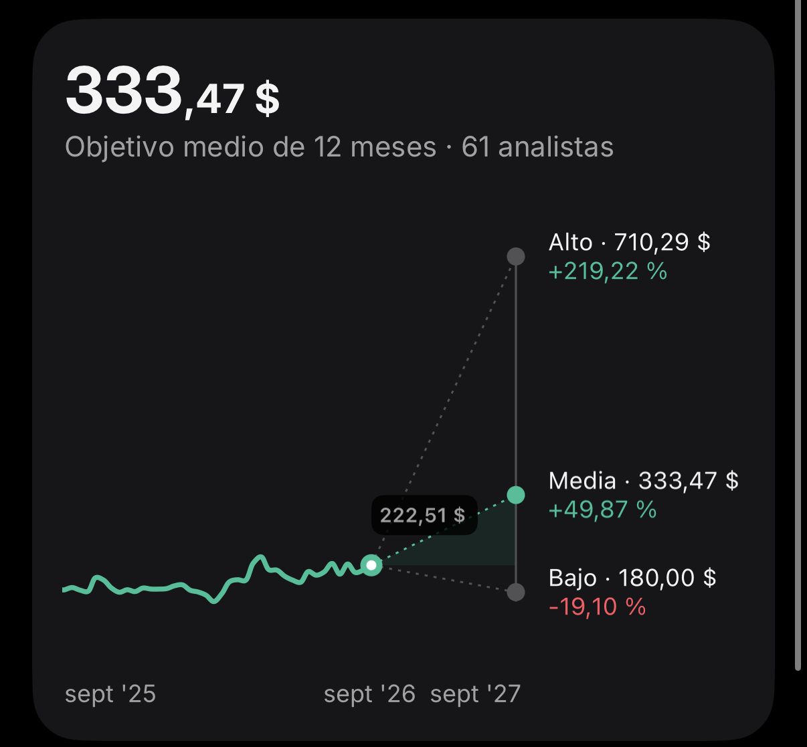

# Producto · Documento maestro

> **Este es el documento maestro del producto.** Lo acordó el equipo el 19-sep-2026 y
> **prevalece sobre cualquier otro documento** ([`PRODUCTO.md`](PRODUCTO.md),
> [`REQUISITOS.md`](REQUISITOS.md) y el research): si algo se contradice, manda este.
> El front que lo implementa vive en [`front/`](../front/README.md).

**Última actualización:** 2026-09-19

---

## Seis preguntas que contesta nuestro sistema

### 1. Quién está sano

No solo quién está en problemas. Reconocer a una empresa excepcionalmente sólida es tan
útil como detectar a la que se hunde.

**Cómo:** leyendo los datos de la empresa, nuestro score financiero da una idea de su
salud. Lo mostramos en la pantalla principal, en grande y como protagonista.

---

### 2. Quién está mejorando

Una empresa que pasa de 45 a 65 puede tener números mediocres hoy y ser la mejor apuesta
del año que viene.

**Cómo:** un gráfico que muestra la evolución del score financiero de la empresa a lo
largo de los meses.

---

### 3. Quién empieza a torcerse

De 82 a 68 sigue pareciendo sana. Pero algo en su comportamiento ya ha cambiado y conviene
verlo ahora.

**Cómo:** mostrar en el gráfico cuándo la empresa empieza a torcerse o a crecer,
comparando la evolución del sector frente a la de la empresa concreta. (Quizá la empresa
se tuerce desde febrero, pero el sector también: entonces no es un problema específico de
la empresa y no hay que preocuparse tanto.)

---

### 4. Bache o caída

Un mes malo de caja no es lo mismo que un deterioro estructural. El sistema tiene que
saber separarlos.

**Cómo:** comparando los datos del resto de meses podemos ver si el problema es puntual o
estructural. Output del algoritmo: *"70 % puntual"* / *"30 % estructural"*.

---

### 5. Por qué ha cambiado

Un número sin explicación no sirve para decidir. Hace falta saber qué señal se movió y
cuándo.

**Cómo:** si el output del algoritmo indica qué se puede hacer para mejorar el score
financiero, podemos sacar el porqué de la caída. El LLM redacta la explicación a partir
del resultado del algoritmo.

---

### 6. Cuándo se vio venir

Detectar algo el mes que pasa no vale mucho. La gracia está en cuántos meses antes lo vio
el sistema.

**Cómo:** un gráfico que muestra la probabilidad de que la empresa suba o baje su score
financiero en los próximos meses, en base a la tendencia de la empresa y la del sector.

---

## Todo se resuelve con 3 cosas básicas de la app

1. **El score en grande** — *output back*.
2. **El gráfico**, que muestra:
   - tendencia — *output front*;
   - cuándo empieza a torcerse, el cambio en la tendencia — *queda por definir*;
   - cada mes, qué porcentaje es bache y qué porcentaje es tendencia
     (p. ej. `feb 2026 · +12 pts · 30 % bache/pico temporal · 70 % tendencia`) — *output back*;
   - en los próximos meses, qué probabilidad hay de cada nivel de score
     (escenario medio, optimista y pesimista) — *output del modelo predictivo*,
     ver el gráfico de arriba.
3. **Lista de acciones a tomar** por la empresa para mejorar el score financiero.
