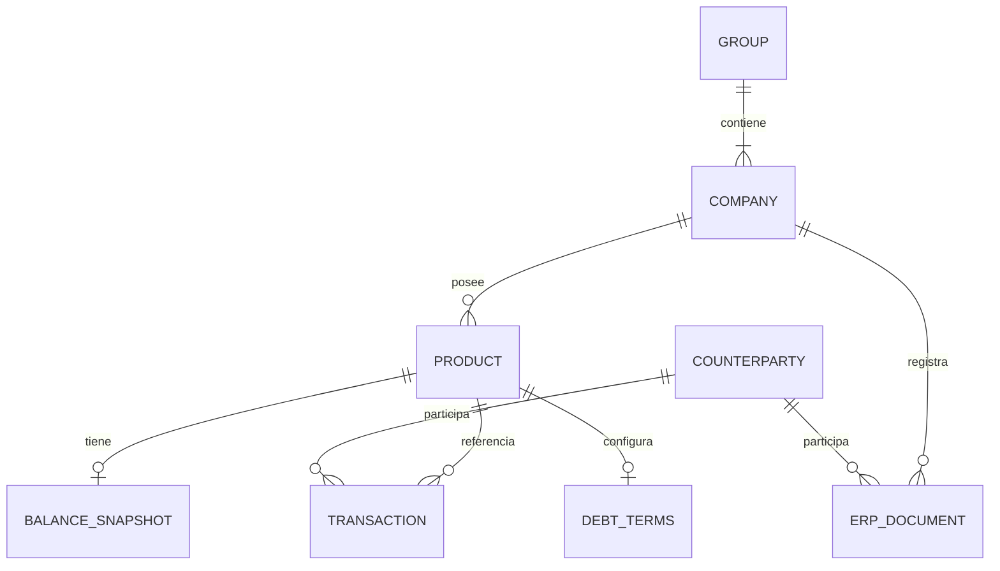
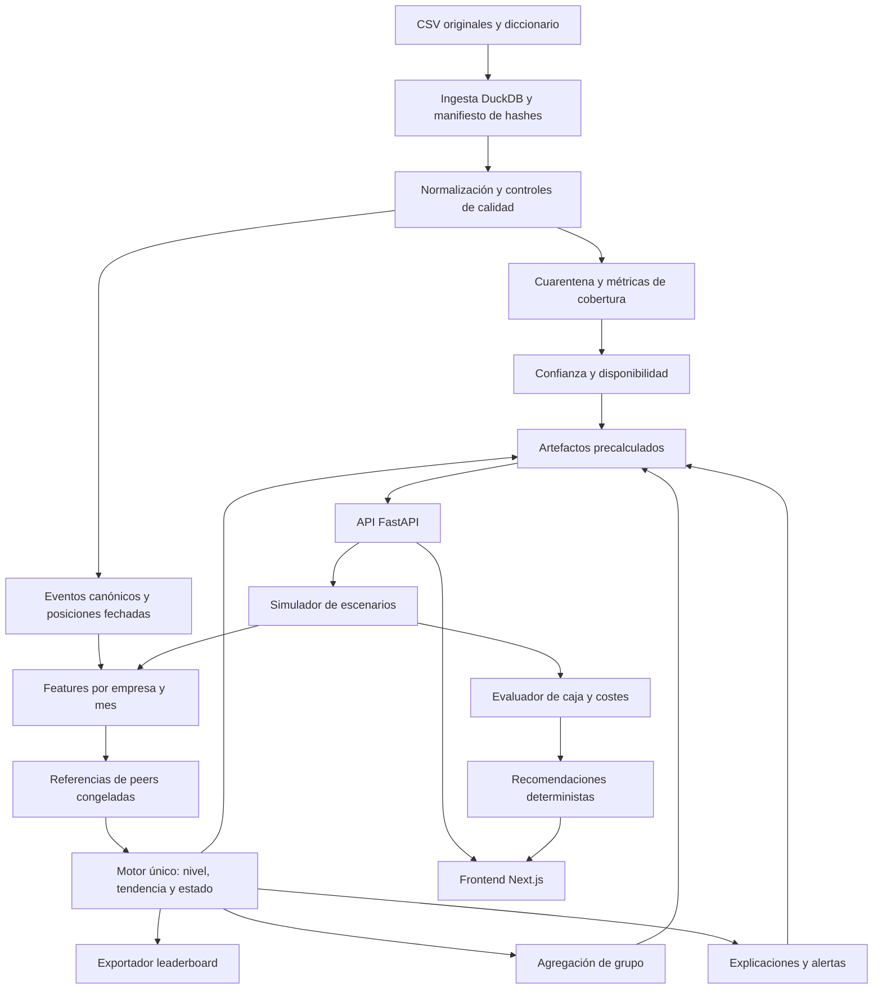

# Arquitectura global · Astra · Carlos · Embat X-Ray

**Fecha:** 18 de septiembre de 2026. **Estado:** propuesta informada por auditoría completa y experimentos ejecutados; la aplicación todavía no está implementada.

**Base documental de la investigación:** estado local sobre `ddbad8e`, con los CSV en `data/`. Al publicar este documento se integra `main` hasta `1e8afcb`, que incorpora otro informe de exploración y una revisión de producto/requisitos. Las comparaciones de §13 describen la versión analizada inicialmente; algunas correcciones ya están recogidas en esa revisión posterior. Los conteos de esta investigación son reproducibles con los hashes y filtros adjuntos, y no deben confundirse con los de una carga desde `dataset/` con otros filtros.

## 1. Recomendación

Construir un **monolito modular en Python, con cálculo batch y API FastAPI**, acompañado de un **frontend Next.js**. El núcleo produce una tabla empresa-mes con nivel de salud, tendencia, estado, confianza y contribuciones explicables. Dashboard, alertas, simulador, recomendaciones y exportación al leaderboard consumen el mismo núcleo y la misma versión de datos.

Mantendría el **score aditivo interpretable** del brief como primera entrega. Añadiría ventanas cortas para detectar cambios y probaría **EWMA y CUSUM** como detectores auxiliares. El aprendizaje supervisado tiene sentido como experimento de predicción de flujos futuros o si aparece una etiqueta oficial; hoy no hay etiquetas de salud en el repo.

La prioridad técnica es **hacer fiables las señales antes de sofisticar el modelo**. Los CSV permiten construir un producto interesante, pero varias premisas de los documentos anteriores no se sostienen literalmente: faltan países, historiales completos, identificación intragrupo y amortizaciones; los estados de facturas y las fechas requieren interpretación. La arquitectura debe representar esas limitaciones.

**Cinco decisiones que tomaría ya:**

1. Unidad interna `company_id × mes`, con relación a `group_id` y exportador adaptable a la unidad oficial.
2. Calendario histórico de **septiembre de 2024 a agosto de 2026**; septiembre de 2026 contiene un solo día y queda como corte parcial separado.
3. Scoring histórico basado en información reconstruible hasta cada fecha; posiciones actuales se muestran aparte cuando no tengan historia fiable.
4. Percentiles congelados, tratamiento explícito de datos ausentes y explicación que incluya también tendencia y saturación del score.
5. Simulaciones con supuestos y restricciones; dinero, fechas y scores siempre calculados por código. Una asociación score-tipo de interés no demuestra ahorro causal.

## 2. Qué he revisado y qué existe realmente

He leído todos los documentos del proyecto: `README.md`, `PRODUCTO.md`, `REQUISITOS.md`, los dos de `.agents/`, los siete de `research/`, `data/README.md`, `data/data_dictionary.md` y `.gitignore`. También he procesado **todas las filas de los ocho CSV: 3.472.176 registros, 646.335.134 bytes**. Los textos libres se cargaron completos; no se ha hecho una inspección humana individual de millones de conceptos.

No había backend, frontend, notebooks, dependencias, pruebas, etiquetas objetivo ni script de scoring. Los documentos describen una solución por construir. Las investigaciones generadas con distintos asistentes contienen alternativas y afirmaciones incompatibles; no son evidencia de implementación ni de rendimiento.

La jerarquía existente sigue siendo enunciado → producto → brief de algoritmo → requisitos. Este documento **propone ajustes apoyados en los datos**, sin modificar esos originales. Las divergencias se enumeran en §13 para que el equipo pueda actualizar la especificación con criterio.

Material reproducible de esta investigación:

- [Auditoría completa](arquitectura_carlos/audit.py) y [resultados con hashes de los CSV](arquitectura_carlos/audit_results.json).
- [Experimentos](arquitectura_carlos/experiments.py) y [métricas, configuración y versiones](arquitectura_carlos/experiment_results.json).
- Estos scripts son herramientas de investigación; no constituyen el motor de producción.

## 3. Radiografía real de los datos

### 3.1. Inventario y relaciones

| Archivo | Filas reales | Papel | Observación decisiva |
|---|---:|---|---|
| `groups.csv` | 250 | Grupo empresarial | Tamaño observado 1–22; mediana 3, frente a 1–24 y mediana 2 del diccionario |
| `companies.csv` | 1.286 | Identidad y grupo | 1.056 sin país; 541 sin ERP; no hay sector ni nombre comercial |
| `banking_products.csv` | 5.987 | Catálogo de productos bancarios | Incluye tipos no enumerados en el diccionario: `wallet`, `risk`, `lineofcomex` |
| `debt_products.csv` | 2.239 | Posición de financiación | Foto actual; importes concedidos mayoritariamente negativos |
| `debt_schedule_config.csv` | 87 | Condiciones de amortización | Solo 40 empresas; 58 tipos fijos y 29 variables |
| `transactions.csv` | 2.556.437 | Eventos bancarios | 2.520.019 `booked`, 6.579 `pending`, 29.839 sin estado |
| `invoices.csv` | 897.894 | Documentos ERP | Solo 760.406 son `invoice`; hay otros nueve tipos |
| `balances.csv` | 7.996 | Posiciones por producto | 7.980 a 01/09/2026; 16 entre 25/08 y 29/08 |



`PRODUCT` es la unión de productos bancarios y de deuda. El diagrama representa las relaciones esperadas; existen referencias huérfanas que deben quedar en cuarentena. `COUNTERPARTY` es una dimensión derivada de IDs, no un CSV con identidad jurídica ni un enlace demostrado a `COMPANY`.

Los IDs principales son únicos en sus respectivas tablas. Todos los `company_id` referencian empresas existentes y todos los grupos existen. Sin embargo, hay **1.314 transacciones y 29 balances con producto desconocido**, además de **2 cuentas de liquidación de amortizaciones ausentes**. Los productos encontrados sí coinciden con su empresa propietaria. La ingesta necesita joins controlados y contabilizar lo excluido.

### 3.2. El tiempo es irregular

- Todas las empresas tienen alguna transacción, pero **412 de 1.286 (32,04 %) tienen menos de 12 meses con movimientos**. La mediana es 18 meses; el mínimo, uno.
- En septiembre de 2024 aparecen 439 empresas; en marzo de 2026, 1.223. No hay 24 observaciones completas para cada empresa.
- El 01/09/2026 aporta **9.242 movimientos**. Comparar ese día con un agosto completo fabricaría un desplome.
- `created_at` es alta en plataforma, no nacimiento de empresa ni de cuenta: hay **342.919 movimientos anteriores al alta de empresa** y **442.660 anteriores al alta de producto**. Puede ser importación de histórico; no se deben eliminar automáticamente.
- Mediana de movimientos por empresa y semana, repartiendo los 24 meses completos: **8,10**; P10 **0,80**. Es una medida sobre calendario fijo (730 días), no sobre semanas activas. El mensual es una elección prudente por heterogeneidad y por el requisito del reto, aunque la regla «mediana <5» del brief no se activa.

**Contrato temporal:** una cuadrícula de 30.864 posiciones posibles, no 30.864 observaciones independientes. Distinguir `observed`, `no_activity`, `unobserved`, `partial`. Rellenar un mes desconocido con cero puede convertir falta de conexión en deterioro financiero. En los primeros cinco meses válidos mostrar métricas sin score consolidado; desde seis, score provisional si hay cobertura suficiente. Un mes ausente rompe la persistencia de una alerta.

### 3.3. Países, divisas y peers

**82,12 % carece de país** y los valores presentes no son ISO homogéneos: `ES`, `ESPAÑA`, `España`, `Spain`, etc. Hay 28 monedas de empresa y 39 en productos bancarios. **887 productos tienen moneda diferente a la de su empresa.**

Por eso no empezaría por país × tamaño sin fallback. Normalizar países y ERPs para calidad y filtros; construir inicialmente referencias por **moneda y tamaño de actividad observado**, con mezcla hacia el global de ratios comparables. País/región solo cuando haya suficientes empresas independientes. No hay base para llamarlo «benchmark sectorial».

`exchange_rate` no viene acompañado de una definición inequívoca de base/cotización para todas las tablas. Hay **77 tipos no positivos en transacciones y 3.389 en facturas**, además de 261 nulos en estas últimas. Multiplicar todo por ese campo y escribir «EUR» sería un error.

**MVP:** ratios dentro de la misma moneda, importes con su divisa y cobertura visible. Usar un subconjunto EUR validado para la demo de euros. La arquitectura completa admite una tabla FX fechada, con fuente y convención explícitas. Convertir flujos al cambio del evento y posiciones al del corte; no usar el cambio actual para toda la historia. Hasta entonces no sumar nominales de monedas distintas.

### 3.4. Facturas: fecha informada no equivale a pago confirmado

Hay **501 empresas sin documentos ERP (38,96 %)**. `document_type` distingue clases de documento, no AR/AP. Un `invoiceGroup`, una factura y un `paymentDocument` pueden representar etapas relacionadas; sumarlos indiscriminadamente puede duplicar actividad.

Hallazgos de auditoría:

| Hallazgo | Registros | Consecuencia |
|---|---:|---|
| Documentos `pending` con `payment_date` | 29.717 de 29.717 | No interpretar cualquier fecha como pago realizado |
| Documentos `overdue` con `payment_date` | 192.554 de 192.556 | La fecha puede ser prevista o heredada del vencimiento |
| Fecha de pago anterior a emisión | 29.089 | Revisar anticipos y errores; excluir del retraso estándar si no se aclara |
| Vencimiento anterior a emisión | 20.869 | Bandera de calidad, sin corregirlo silenciosamente |
| Pago posterior al día de corte | 51.991 | No usarlo como pago conocido en la historia |
| `paid` con pendiente distinto de cero | 300 | Estado y saldo no siempre concuerdan |
| Pendiente parcial, entre cero e importe absoluto | 6.994 | No se conoce el calendario de pagos parciales |

El máximo vencimiento llega a **7025-07-31** y el máximo pago a **6913-11-20**. Hay seis vencimientos y cuatro pagos posteriores a 2099. Que una fecha se pueda parsear no la hace válida.

**Sonda del signo:** crucé facturas `invoice/paid` con movimientos `booked`, misma empresa, contraparte, moneda, importe absoluto exacto y fecha a ±3 días. Entre **91.596 facturas con un único candidato**, **91.258 (99,63 %) comparten signo**. Es evidencia a favor de positivo=cobro y negativo=pago, pero no una garantía para todos los ERPs, abonos y documentos. La prueba no impone unicidad inversa movimiento→factura y no demuestra conciliación contable.

Propuesta: inferir AR/AP por signo solo para `invoice` ordinarias, con `direction_source=sign_inferred`, reglas documentadas y confirmación de Embat. Resolver abonos por separado; mantener dirección desconocida donde corresponda. Para pagos históricos, exigir estado compatible, fecha coherente y preferiblemente conciliación bancaria. La foto final permite una reconstrucción aproximada, no un histórico exacto de revisiones y pagos parciales.

### 3.5. Contrapartes y clasificación bancaria

- Solo **250.778 movimientos (9,81 %) tienen contraparte**; en documentos ERP la cobertura es mucho mayor.
- Hay **47.796 contrapartes bancarias**, **124.030 en ERP** y **42.125 compartidas**.
- **Cero cruces directos `counterparty_id = company_id`**. Son espacios `COUNTERPARTY_…` y `COMP_…`; no convertir prefijos para fabricar relaciones.
- **442.396 documentos (49,27 %)** comparten pareja empresa-contraparte con algún movimiento; eso no significa que tengan su pago conciliado.
- **635.860 movimientos (24,87 %) tienen categoría `-` o nula**. `transfer` tampoco dice por sí solo si el dinero es operativo, financiación o intragrupo.

**Decisión:** queda fuera del MVP el grafo de contagio entre empresas puntuadas. Sí se puede construir una red bipartita empresa-contraparte y estudiar concentración o pagos a una misma contraparte, mostrando cobertura y evitando atribuirle una identidad empresarial no demostrada. Tampoco podemos prometer eliminar todo el intragrupo con los CSV actuales.

Para clasificar flujos, empezar con reglas explícitas y separar operativo, financiación, inversión, transferencias y desconocido. Una categoría dudosa no se fuerza a ingresos. Un clasificador de texto podría ayudar después, con muestra revisada y evaluación; el texto anonimizado no permite recuperar identidades.

### 3.6. Deuda y saldos: útiles, pero principalmente actuales

| Cobertura | Empresas | % sobre 1.286 |
|---|---:|---:|
| Línea de crédito | 206 | 16,02 % |
| Factoring | 19 | 1,48 % |
| Avales | 51 | 3,97 % |
| Alguna configuración de amortización | 40 | 3,11 % |

Solo **87/2.239 productos de deuda (3,89 %)** tienen cuadro configurado. **81 de las 87 próximas cuotas figuran antes del corte**: revisar vigencia antes de proyectarlas. `debt_products.csv` no contiene un campo de tipo de interés; los tipos/spreads están únicamente en `debt_schedule_config.csv`.

El concedido es normalmente negativo. Hay saldos de deuda positivos —incluidas 110 líneas—, por lo que `abs(outstanding)` no equivale automáticamente a deuda dispuesta. Normalización provisional para líneas con convención confirmada: límite `abs(granted)`, dispuesto `max(-outstanding, 0)`, alertando por signos inesperados, límite nulo/cero y excedidos. Separar un saldo acreedor de una deuda; un aval no es caja utilizable.

En `balances`, **`available` está vacío en las 7.996 filas**. No basar el runway en él. Los balances incluyen deuda, tarjetas, inversiones y otros productos: sumar toda la columna `balance` no da efectivo.

La identidad retrospectiva por cuenta sería:

```text
saldo_estimado(t) = saldo_observado(T) − Σ movimientos_contabilizados(t, T]
```

Es válida bajo integridad del libro, misma moneda, misma base contable y corte consistente. Con una sola posición no se puede demostrar que no faltan eventos: «volver al saldo final» es una comprobación circular. Además, reconstruir con datos posteriores a `t` no demuestra que el saldo fuese conocido en `t`. Guardar estas series como **reconstrucción retrospectiva**, fuera de la validación estricta de anticipación. Pedir posiciones históricas para un runway histórico fiable.

## 4. Arquitectura de extremo a extremo



La flecha del simulador a features es una **invocación sobre una copia del escenario**, sin mutar el histórico ni recalibrar peers. El LLM, si se añade, selecciona acciones permitidas y explica resultados de herramientas. El camino completo funciona también sin LLM.

### 4.1. Stack y despliegue

| Capa | Elección propuesta | Motivo |
|---|---|---|
| Ingesta y agregaciones | Python + DuckDB + Parquet | SQL sobre millones de registros sin servidor de datos |
| Núcleo numérico | NumPy; SciPy/scikit-learn para experimentos | Fórmulas pequeñas, reproducibles y separadas del servicio |
| Configuración | YAML/JSON versionado | Pesos, direcciones, ventanas, umbrales y clasificaciones fuera del código |
| Contrato HTTP | FastAPI + modelos Pydantic | Esquemas explícitos y documentación del contrato |
| Persistencia MVP | Parquet + manifiestos JSON; SQLite si hacen falta escenarios guardados | Evita administrar infraestructura innecesaria |
| Front | Next.js/React + componentes acordados con Quirce/Hugo | Cartera, detalle, simulación y grupo |
| Ejecución | Batch por CLI + un servicio API | El volumen local permite una arquitectura simple |

DuckDB documenta lectura CSV y escritura/lectura Parquet; en producción fijaría esquema y dialecto tras la exploración, sin depender de la inferencia automática en cada ejecución. [CSV](https://duckdb.org/docs/stable/data/csv/overview), [Parquet](https://duckdb.org/docs/stable/data/parquet/overview).

La auditoría completa, hashes y consultas incluidas, tardó **6,57 s en este equipo**. No es un benchmark del pipeline final ni de la API. Aun así, no hay evidencia de que necesitemos Spark, Kafka, microservicios o una base de grafos para este volumen.

**Despliegue del MVP:** batch local/CI autorizado que genera un bundle versionado; API en un contenedor con ese bundle en lectura; frontend en el alojamiento del equipo. Precargar scores y agregados por empresa. Evitar leer 646 MB de CSV en cada petición. Los procesos web no comparten un DuckDB abierto en escritura; publicar un nuevo bundle de forma atómica. El front debe tener respuestas precargadas para el recorrido de demo.

No hace falta un planificador distribuido para simular actualización mensual: basta un comando que avance el corte y publique nuevas alertas. En producción, ingesta incremental e idempotente por evento, almacenamiento persistente, control de acceso por grupo y aislamiento de clientes.

### 4.2. Estructura propuesta del repositorio

```text
src/xray/
  ingestion/          # esquemas, carga, validación, cuarentena
  domain/             # tipos de dato, monedas, estados y fechas
  features/           # cashflow, pagos, deuda, concentración, ventanas
  scoring/            # peers, nivel, tendencia, estados, explicación
  scenarios/          # transformaciones, restricciones y recomputación
  monitoring/         # detectores, episodios y métricas de alerta
  reporting/          # grupos, dossier y exportador oficial
  api/                # endpoints y DTO; sin fórmulas duplicadas
frontend/             # cartera, empresa, grupo y simulador
config/               # score, clasificación, calidad, peers
tests/                # invariantes temporales, económicos y del contrato
artifacts/<run_id>/   # datos derivados; fuera de Git
research/arquitectura_carlos/  # investigación realizada
```

Es una estructura futura, no carpetas de aplicación creadas en esta tarea. El dataset original permanece local; actualmente todo `data/` está ignorado. `data/README.md` conserva referencias desactualizadas a CSV versionados.

## 5. Contrato de datos y reproducibilidad

### 5.1. Tres capas persistidas

1. **Original:** CSV inmutables, hash, tamaño, filas, esquema y versión del diccionario.
2. **Canónica:** eventos tipados, posición de deuda/caja con `as_of`, clasificación y evidencias; todas las exclusiones conservan razón.
3. **Analítica:** `company_month_features`, percentiles, scores, contribuciones, alertas y escenarios.

Importes monetarios como `DECIMAL` en preparación y simulaciones; conversión explícita a float para ratios/modelos. Nunca unir primero todas las transacciones con todas las facturas por empresa: multiplica filas e importes. Agregar cada fuente a su granularidad o usar una tabla de correspondencias validada.

Cada feature debe incluir:

```text
company_id, month, feature_name, value, unit, currency,
window_start, window_end, observation_count, coverage,
availability_status, temporal_provenance, reason_codes, source_reference
```

`availability_status`: `observed`, `estimated`, `missing`, `not_applicable`. `temporal_provenance`: `event_reconstructed`, `current_snapshot`, `retrospective_estimate`; en producción, añadir `known_at` real. Una referencia de origen puede ser una consulta más conjunto de IDs; no incrustar miles de filas en una respuesta web.

El `run_manifest` fija hashes de entrada, versión de código/configuración, fecha de corte, política monetaria, grupos de calibración y versión del modelo. Misma entrada + misma versión → misma salida. La tabla analítica se publica cuando todas las comprobaciones pasan.

### 5.2. Reglas temporales concretas

- Filtrar movimientos por `date <= cutoff`; `value_date` tiene extremos hasta 2099 y requiere revisión. No es una sustitución automática de la fecha contable.
- Filtrar documentos por emisión hasta el corte. Un vencimiento futuro puede ser un término contractual conocido; un pago futuro no es un evento consumado.
- **No propagar `status`, `pending_amount`, conciliación o deuda finales hacia todos los meses.** Un estado final `paid` más fecha coherente permite aproximar un pago anterior; no reconstruye pagos parciales ni fecha de última edición.
- Donde se asuma pago único, documentarlo y medir cuántas filas/importe quedan fuera. Usar intervalos de incertidumbre o desactivar la feature cuando la reconstrucción no sea defendible.
- La elegibilidad y la referencia de tamaño de un peer se calculan con datos disponibles en calibración. Tampoco ajustar medianas, deciles o escaladores con meses futuros del train.
- Congelar el peer durante un escenario para evitar que modificar ingresos mejore el score cambiando el grupo de comparación.

## 6. Features que realmente podemos construir

| Bloque | Señales prioritarias | Uso con estos datos |
|---|---|---|
| Flujo | Ratio neto/entradas, ratio neto/flujo bruto, proporción de meses negativos, volatilidad, crecimiento | Núcleo histórico, con clasificación y cobertura declaradas |
| Pagos/cobros | Retraso ponderado, fracción pagada tarde, vencido reconstruido, edad de saldos | Condicionado a dirección y pago realizado; excluir fechas incoherentes |
| Deuda | Utilización actual, deuda/actividad anualizada, coste de cuotas conocido | Foto actual; servicio histórico solo cuando haya evidencia |
| Concentración | HHI y top-1/top-3, recurrencia por contraparte | Preferir fuente con cobertura suficiente; separar cobros y pagos |
| Trayectoria | Pendientes 3/6 meses, medias 3 frente a 12, dispersión y persistencia | Datos hasta el corte; 12 meses como ancla, 3 como señal rápida |
| Confianza | Cobertura temporal, de moneda, clasificación y contraparte; filas descartadas | Se informa aparte del score |

**Definiciones que deben quedar cerradas:**

- `net_margin = (entradas − salidas) / entradas`: indefinido sin entradas; no solucionar con un epsilon que produzca millones.
- Como alternativa acotada, `net_flow_share = (entradas − salidas)/(entradas + salidas)`, entre −1 y 1. Es la variable usada en las pruebas; no es un margen contable.
- `cash_buffer_months = efectivo / salidas_operativas_medias` y `net_burn_runway = efectivo / max(salidas − entradas, 0)` son conceptos distintos. Si no hay burn, el segundo no se sustituye por infinito numérico ni se llama «meses sin ingresos».
- `DBT = Σ importe_abs × max(fecha_pago − vencimiento, 0) / Σ importe_abs`, sobre pagos realizados válidos. Por separado: antigüedad de facturas aún abiertas para evitar seleccionar solo las que ya se han pagado.
- Retraso desde emisión y DSO contable no son idénticos. Nombrar «días observados hasta cobro» cuando se use una media de pagos; el DSO contable requiere saldo AR y ventas consistentes.
- `HHI = Σ cuota_contraparte²`. Publicar también el porcentaje de importe con contraparte. No convertir todos los nulos en un único cliente ni extrapolar del 9,81 % de movimientos al 100 % del negocio.
- No llamar DSCR completo a un cociente con un calendario que cubre solo parte de la deuda. Un servicio observado por categorías bancarias también necesita confirmar cobertura y excluir doble contabilización de cuotas.

Los pesos de deuda pueden permanecer neutros cuando el dato no existe; su ausencia no demuestra solvencia. Empresa sin producto y empresa sin dato son estados distintos. Para una primera versión estable, imputar **percentil neutral 50** conservando peso y cobertura, sin renormalizar dinámicamente cada mes. Si falta demasiado peso material, devolver `score=null` y `estado=datos_insuficientes`. El umbral de cobertura será configurable y debe validarse; no está estimado en estas pruebas.

## 7. Motor de score, tendencia y explicación

### 7.1. Nivel interpretable

Conservar las cuatro familias del brief y pesos iniciales 30/30/25/15 como **hipótesis**, no como parámetros aprendidos:

```text
p_j = percentil saludable de la feature j contra referencia congelada
N(t) = Σ_j w_j · p_j(t),     Σ_j w_j = 1
```

Aplicar la inversión de dirección una sola vez. Para percentiles con muchos empates, usar posición media; con deciles repetidos, evitar divisiones por cero. Fuera de rango, saturar; peer nuevo, fallback explícito. Las medianas e imputaciones también pertenecen al artefacto de calibración.

Contar **empresas/grupos independientes**, no filas empresa-mes, para juzgar tamaño de peer. Evitar que un grupo con 22 filiales domine la referencia. El *shrinkage* local-global del brief es adecuado, pero el grupo global de importes debe respetar moneda; para ratios adimensionales se puede compartir más.

### 7.2. Separar nivel, trayectoria y severidad

Versión inicial reproducible del brief:

```text
T(t) = mediana de las tres últimas pendientes OLS de seis meses de N
S_raw(t) = N(t) + 0,4 · k · T(t)
S(t) = clip(S_raw(t), 0, 100)
```

Primer envío `k=0`; variante `k=3` una vez medido. La tendencia se expresa en puntos/mes y no es una predicción calibrada del score futuro.

**Problema con los umbrales actuales:** si los ejemplos del enunciado fueran lineales en 24 puntos, 45→65 tendría pendiente **+0,87** y 82→68, **−0,61**. Ninguno superaría ±1 punto/mes. No se puede exigir esos estados en el criterio de aceptación sin considerar la trayectoria real o revisar los umbrales.

Además de los estados del brief, el contrato necesita `datos_insuficientes` y una transición pendiente de confirmar. Una empresa en nivel bajo y trayectoria plana no puede parecer saludable por mostrar «Estable»: presentar **nivel/severidad** y **dirección** por separado.

Un «bache confirmado» solo se conoce tras recuperar. En el mes de caída mostrar «caída reciente, pendiente de confirmación». Guardar `event_month` y `detected_at` separados; no retrofechar una detección cuando dos meses después se clasifica el episodio como bache.

Probar un detector rápido sobre features de 3 meses y uno lento sobre nivel de 12. Encadenar ventana anual, regresión de seis meses, mediana de tres y persistencia de tres puede introducir demasiado retraso.

### 7.3. Explicación exacta de verdad

La fórmula de variación de `REQUISITOS.md` explica el **nivel**, pero omite la trayectoria del score compuesto. La descomposición correcta es:

```text
c_j(t) = w_j · (p_j(t) − 50)
C(t) = S(t) − S_raw(t)

S(t) = 50 + Σ_j c_j(t) + 0,4 · k · T(t) + C(t)
ΔS = Σ_j Δc_j + 0,4 · k · ΔT + ΔC
```

Mostrar las contribuciones de features/bloques, un término explícito de trayectoria y, si existe, saturación. Así la suma cuadra incluso en 0/100. La mediana de pendientes no se reparte de forma lineal por feature; no inventar esa atribución.

Contribución matemática tampoco significa causa económica. «El aumento del retraso explica −3 puntos según esta fórmula» es defendible; «ese retraso causó el deterioro empresarial» necesita otra evidencia.

La confianza es un indicador de calidad, **no probabilidad de acierto**. El 61,56 % de movimientos tiene conciliación vacía; no fijar confianza alta con un campo parcialmente observado ni tratar `DISCARDED` como conciliado automáticamente. Mostrar componentes disponibles y método de cálculo; una suma arbitraria no equivale a calibración estadística.

## 8. Algoritmos: qué probar y qué dejar para después

| Algoritmo | Qué resuelve | Etiqueta necesaria | Prioridad / condición |
|---|---|---|---|
| Score aditivo + percentiles | Nivel de salud relativo y explicable | No | **P0**, entrega inicial y referencia común |
| OLS y Theil–Sen, ventanas 3/6 | Dirección y robustez ante meses atípicos | No | **P0/P1**; OLS primero, Theil–Sen como contraste |
| EWMA rápida/lenta | Cambio reciente frente a comportamiento de fondo | No | **P1**, candidato para monitor |
| CUSUM bilateral | Acumulación de desviaciones pequeñas | No | **P1**, calibrar falsas alarmas y reset/cooldown |
| Media reciente y estacional naïve | Baselines de flujo futuro | Futuro observado | **P0 experimental**, referencia obligatoria antes de ML |
| Ridge / Elastic Net | Predicción regularizada de flujos futuros | Futuro observado | **P1 experimental**, no convertir directamente en salud |
| Histogram GBDT, LightGBM/CatBoost | Interacciones tabulares | Etiqueta oficial o futuro observado | **P1/P2** si aporta mejora fuera de muestra |
| EBM/GAM | Aprender relaciones conservando estructura explicable | Sí | Alternativa si llegan etiquetas y hay tiempo |
| PELT / `ruptures` | Segmentar trayectorias retrospectivamente | No | Análisis offline; no demostrar anticipación con el segmento completo |
| Isolation Forest | Detectar rareza de datos o comportamiento | No | Calidad/triage; rareza no equivale a mala salud |
| Kalman / BOCPD / HMM | Estado latente y régimen | Supuestos/ajuste compartido | Investigación posterior; 24 meses son pocos por entidad |
| Modelo de tiempo hasta pago | Cobros abiertos y censura | Pagos realizados fiables | Interesante después de aclarar semántica de `payment_date` |
| Grafo bipartito | Exposición compartida a contrapartes | No necesariamente | P2; no confundirlo con identidad ni contagio demostrado |

Theil–Sen ofrece una regresión robusta; CUSUM está diseñado para detectar desplazamientos acumulados; `ruptures` se presenta como detección **offline**. Esas propiedades justifican los candidatos, no prueban rendimiento financiero aquí. [Theil–Sen](https://scikit-learn.org/stable/modules/generated/sklearn.linear_model.TheilSenRegressor.html), [CUSUM/NIST](https://www.itl.nist.gov/div898/handbook/pmc/section3/pmc323.htm), [ruptures](https://centre-borelli.github.io/ruptures-docs/).

Si hay etiquetas, comparar lineal/EBM/GBDT con el mismo protocolo y presupuestos pequeños. LightGBM admite restricciones monotónicas; aplicarlas solo donde exista una relación defendible manteniendo el resto fijo. Un mayor DPO o mayores entradas no son universalmente mejores. [LightGBM](https://lightgbm.readthedocs.io/en/stable/Parameters.html), [EBM](https://interpret.ml/docs/ebm.html).

Descartaría del MVP Transformers/LSTM por coste y falta de evidencia; Altman/Merton porque faltan estados contables o cotización; WOE/IV y probabilidad de impago calibrada porque falta etiqueta. SHAP es innecesario para el score aditivo; si se adopta otro modelo habrá que actualizar expresamente el contrato de explicación y los requisitos.

## 9. Experimentos ejecutados

### 9.1. Predicción de flujo futuro con datos del reto

**Pregunta:** ¿un modelo tabular sencillo mejora una referencia de persistencia para anticipar el saldo de entradas/salidas de los próximos tres meses?

Se utilizaron **1.076.642 movimientos**: `booked`, cuentas `checking/saving`, empresas EUR cuyo inventario completo de productos está en EUR, categorías operativas explícitas. Se excluyeron transferencias, desconocidos, inversión y deuda. Son flujos seleccionados, no una reconstrucción completa del flujo operativo.

El conjunto inicial contiene **919 empresas**. Tras exigir seis meses consecutivos de actividad observada y tres futuros, quedaron **7.361 muestras**; la evaluación tiene **2.290 observaciones de 624 empresas y 148 grupos**.

```text
y(t) = Σ entradas−salidas en t+1…t+3 / Σ entradas+salidas en t+1…t+3
```

Diez features: ratio del último mes, ratios acumulados 3/6m, desviación y frecuencia negativa en 6m, pendiente, log de entradas/salidas/número de movimientos y crecimiento reciente de entradas. Modelos con parámetros fijos; sin búsqueda de hiperparámetros.

**Separación:** cinco folds deterministas por hash de `group_id`. Para cada fold se entrena con otros grupos y orígenes hasta noviembre de 2025; sus targets terminan como máximo en febrero de 2026. Se evalúan orígenes febrero–mayo de 2026 de grupos excluidos, con targets marzo–agosto. Ningún grupo evaluado aparece en su entrenamiento, ni el target de entrenamiento invade el periodo futuro evaluado.

| Método | MAE ↓ | Spearman ↑ | Acierto signo del flujo ↑ | MAE medio por grupo ↓ |
|---|---:|---:|---:|---:|
| Último mes | 0,3507 | 0,4213 | 64,24 % | 0,3445 |
| Ratio acumulado últimos 3m | 0,2837 | 0,4781 | 65,90 % | 0,2842 |
| **Ratio acumulado últimos 6m** | **0,2631** | 0,5109 | **67,34 %** | **0,2685** |
| Mismos tres meses del año anterior | 0,3783 | 0,2927 | 59,00 % | 0,3757 |
| Ridge, `alpha=10` | 0,2764 | **0,5307** | 66,94 % | 0,2776 |
| Histogram GBDT, 100 iteraciones/7 hojas | 0,2673 | 0,5146 | 67,03 % | 0,2695 |

**Lectura:** el baseline de seis meses obtuvo el menor MAE; Ridge obtuvo mejor correlación de rangos. La selección depende de la métrica, que todavía no conocemos para el leaderboard. No hay evidencia aquí para sustituir el núcleo interpretable por GBDT. El GBDT probado es el de scikit-learn, no LightGBM ni CatBoost. [Implementación](https://scikit-learn.org/stable/modules/generated/sklearn.ensemble.HistGradientBoostingRegressor.html).

**Límites:** no son métricas de salud financiera, impago ni competición. La selección de cohortes usa el inventario final y existencia de actividad futura, así que hay sesgo de selección. Los CSV no versionan categorías ni estado bancario. El baseline estacional usa cero si su trimestre histórico carece de actividad, penalizándolo; hay que compararlo también en una cohorte con historia estacional completa. Los horizontes de evaluación se solapan y las filas están correlacionadas. No se han calculado intervalos de incertidumbre; diferencias pequeñas no demuestran superioridad estadística. El acierto de signo se refiere a flujo positivo/negativo, no a mejora/deterioro.

### 9.2. Detectores sobre trayectorias controladas

**Objetivo:** medir la latencia que introduce la regla del brief y comprobar sensibilidad a un bache. Generé 1.000 series de 24 meses por escenario, semilla 42, nivel inicial 50 y ruido normal σ=2. En el mes 13 se introduce, según escenario, un único descenso de 12 puntos o una rampa de ±2 puntos/mes. Los umbrales se fijaron antes de ejecutar; no se calibraron a igual tasa de falsas alarmas.

| Detector | Series estables con alguna alerta | Series con bache que alertan | Retraso mediano ante deterioro | Retraso ante mejora |
|---|---:|---:|---:|---:|
| OLS6 + mediana3 + persistencia3; umbral ±1 | 0,5 % | 17,3 % | 5 meses | 5 meses |
| EWMA α=0,5/0,15; diferencia >3; persistencia2 | 0,0 % | 3,1 % | 4 meses | 4 meses |
| CUSUM bilateral; k=0,5σ, h=5σ | 22,5 % | 78,7 % | 2 meses | 2 meses |

El CUSUM se centra/escala con ocho observaciones iniciales —una estimación ruidosa— y devuelve la primera alarma. Las tasas son **por serie**, no alarmas por empresa-año. Los retrasos se calculan entre primeras detecciones posteriores al comienzo del cambio; el JSON conserva también las alertas previas. La prueba de OLS recibe directamente el nivel simulado: no incluye un suavizado previo de 12 meses.

**Decisión:** conservar el baseline auditable, pero investigar EWMA como detector auxiliar y calibrar CUSUM antes de usarlo. Rapidez sin control de falsas alarmas no basta. Estos resultados son un ensayo controlado de mecanismos, **no anticipación demostrada en las empresas de Embat**.

### 9.3. Cómo repetir las pruebas

Desde la raíz, con Python y `uv` disponibles:

```bash
UV_CACHE_DIR=/tmp/embat-uv-cache uv venv /tmp/embat-arquitectura-venv
UV_CACHE_DIR=/tmp/embat-uv-cache uv pip install --python /tmp/embat-arquitectura-venv/bin/python -r research/arquitectura_carlos/requirements.txt
/tmp/embat-arquitectura-venv/bin/python research/arquitectura_carlos/audit.py --db /tmp/embat-audit.duckdb
OMP_NUM_THREADS=2 /tmp/embat-arquitectura-venv/bin/python research/arquitectura_carlos/experiments.py --db /tmp/embat-audit.duckdb
```

La instalación requiere acceso a PyPI. La auditoría relee los ocho CSV completos, registra sus hashes y reemplaza las tablas de su base de trabajo. Los resultados JSON se regeneran; tiempos y últimos decimales pueden variar por plataforma. La base y entorno están en `/tmp`; los originales no se modifican. Versiones utilizadas: Python 3.14.0, DuckDB 1.5.5, NumPy 2.5.3, SciPy 1.18.1, scikit-learn 1.9.1.

## 10. Validación que debería acompañar al motor

**Sin etiqueta oficial:** verificar coherencia, sensibilidad y utilidad prospectiva de señales. No presentar AUC/Gini/PD sobre una etiqueta que hemos inventado como precisión real. Un ELMS definido con las propias features sirve como prueba de coherencia futura, no validación independiente de solvencia. Además, hoy no tenemos utilización histórica de líneas para el ELMS original completo.

**Con etiqueta oficial:** confirmar unidad, horizonte, formato y métrica. Construir folds que combinen grupos excluidos y tiempo; `GroupKFold` por sí solo no garantiza causalidad temporal, y `TimeSeriesSplit` por sí solo no aísla grupos. Purga de los targets futuros que invadan la validación; calibración e imputaciones exclusivamente dentro del train. [GroupKFold](https://scikit-learn.org/stable/modules/generated/sklearn.model_selection.GroupKFold.html), [TimeSeriesSplit](https://scikit-learn.org/stable/modules/generated/sklearn.model_selection.TimeSeriesSplit.html).

**Pruebas necesarias:**

| Prueba | Qué debe cumplirse |
|---|---|
| Corte temporal | Añadir eventos posteriores no altera un score histórico de la vía estricta |
| Calibración congelada | Puntuar una empresa sola o con otras 50 da el mismo resultado |
| Idempotencia | Cargar dos veces el mismo archivo no duplica eventos |
| Integridad | Joins no multiplican importes; cada exclusión tiene razón y conteo |
| Moneda | No sumar EUR y USD sin conversión explícita |
| Explicación | Contribuciones + trayectoria + saturación suman score y delta con error <0,01 |
| Sensibilidad | Pesos ±10 pp, reescalados, y ranking comparado por grupo y cobertura |
| Monotonía local | Una mejora aislada y válida no empeora la feature orientada; vigilar interacciones del escenario |
| Falta de datos | Ausencia no se convierte en cero económico ni en solvencia demostrada |
| Simulación | Escenario cero reproduce el resultado; escenarios no modifican originales |
| Composición | Simular dos acciones juntas respeta restricciones y evita doble gasto |
| Publicación | Front, API, monitor y exportador comparten el mismo `run_id` |

Para anticipación, fijar antes el evento material futuro, ventana de emparejamiento, umbral, cooldown y exposición válida. Reportar cobertura de eventos, precisión de alertas, retraso/anticipación mediana y falsas alertas por empresa-año; analizar mejora y deterioro. Las alertas repetidas de un episodio cuentan una vez. Bootstrap por **grupo**, no por fila. Calibrar el umbral en desarrollo y evaluar en grupos/tiempo separados.

No convertir umbrales como estabilidad >0,85 o mejora >0,005 en leyes universales: son criterios del brief por validar. Un score constante sería estable y poco útil. Un CUSUM que reconoce un cambio ya sucedido puede tener retraso positivo; no es anticipación hasta compararlo con un evento futuro definido independientemente.

## 11. Producto, simulador y contratos

### 11.1. API compatible con el reparto actual

Mantener los cuatro endpoints acordados y extenderlos con metadatos. Añadir un listado para cartera: hoy el contrato no incluye cómo descubrir entidades.

| Endpoint | Resultado |
|---|---|
| `GET /entities?month=&group_id=&cursor=` | Cartera paginada y cobertura |
| `GET /score/{entity_id}?month=` | Score, nivel, tendencia, estado, confianza, drivers y trayectoria |
| `GET /group/{group_id}?month=` | Índice de grupo, filiales, peores filiales materiales y disponibilidad |
| `POST /simulate` | Escenario, score condicionado, caja/costes y supuestos |
| `GET /alerts?desde=` | Alertas con fecha real de detección y evidencia |
| `GET /health` | Estado del servicio y versión cargada |

Campos comunes: `run_id`, `model_version`, `as_of`, `data_cutoff`, `entity_type`, `currency`, `coverage`, `warnings`. `trayectoria` puede tener 24 posiciones con valores nulos y su motivo; no inventar 24 scores. `meses_anticipación` es nulo para una alerta viva cuyo evento futuro todavía no se conoce.

Congelar las claves ya acordadas (`nivel`, `tendencia`, `estado`, `confianza`, etc.) en un esquema común; no traducirlas de forma distinta en cada servicio. Error 404 para entidad desconocida, 422 para parámetros inválidos y errores de dominio claros para acciones inaplicables. Ausencia de dato puede ser una respuesta válida con disponibilidad, no necesariamente un error HTTP.

Objetivo de latencia de `/score` y `/simulate`: <1 s para casos de demo, **pendiente de medir**. Cachear por versión de modelo/datos, entidad, corte y hash del escenario normalizado. Una nueva configuración invalida resultados anteriores.

### 11.2. Simular acciones sin inventar historia

Contrato interno propuesto:

```text
ScenarioInput(entity_id, as_of, horizon_months, actions, assumptions)
→ validar aplicabilidad y recursos
→ copiar estado inicial y flujos futuros de referencia
→ aplicar cambios de fecha/importe/deuda
→ recomputar features y score con peers congelados
→ comparar escenario y referencia en el MISMO horizonte
→ devolver deltas, cobertura, costes y trazabilidad
```

Cobrar antes a partir de hoy cambia el futuro. No debe reescribir pagos del pasado para mejorar artificialmente el score histórico. Separar «escenario proyectado» de «contrafactual retrospectivo», si se implementa este último. Evitar contar dos veces el pago futuro de una factura adelantada.

Empezaría con tres palancas bien soportadas y ampliaría el catálogo:

| Palanca | Transformación | Restricciones |
|---|---|---|
| Adelantar cobros identificados | Mover cobros pendientes en calendario | No anterior al corte; importe realmente pendiente; dirección fiable; coste si hay descuento |
| Reducir gastos operativos | Reducir categorías seleccionadas en meses futuros | Porcentaje acotado; costes declarados; no recortar cuotas/impuestos por accidente |
| Amortizar línea con caja | Reducir efectivo y dispuesto conjuntamente | Caja suficiente, límite/signo fiables, sin duplicar la misma caja en otras acciones |
| Renegociar plazo de proveedor | Mover vencimiento/pago futuro | Acuerdo supuesto explícito; no convertir unilateralmente mora en DPO favorable |
| Refinanciar | Reemplazar calendario y tipo con nueva oferta supuesta | Principal, plazo, comisiones, referencia variable y fecha disponibles |

Reducir concentración no es un cambio gratuito de `HHI`: requiere ventas nuevas, sustitución o pérdida de clientes y su efecto económico. Sustituir factoring por línea requiere que ambos existan y conocer límites/costes. Las palancas no aplicables se deshabilitan con explicación.

### 11.3. Euros: distinguir caja adelantada y ahorro

`ΔDSO × ventas diarias` es una estimación de liberación de circulante bajo ventas estables y definición consistente de DSO. **No es automáticamente dinero cobrado ni beneficio anual.** Para facturas concretas, calcular la diferencia acumulada de caja a cada horizonte con el calendario de cobros; el cobro adelantado deja de ser ventaja cuando llega la fecha original, salvo efecto recurrente.

El coste financiero de una hipótesis explícita puede calcularse, por ejemplo:

```text
ahorro_intereses = principal_afectado × (tipo_base − tipo_escenario) × días/base_anual
ahorro_neto = ahorro_intereses − comisiones − descuentos − costes_de_implantación
```

Conservar `caja_liberada_eur`, `delta_bps`, `eur_año` del contrato, permitiendo **null** y motivo cuando falten moneda, datos o base suficiente. Nunca devolver cero para aparentar que se estimó algo inexistente.

No estimaría una curva universal score→tipo con solo 87 términos de 40 empresas, mezclando tipos fijos y spreads variables. Aun con más datos, asociación no identifica el efecto de mejorar el score: banco, plazo, garantía y fecha influyen. Un escenario con tipo ofertado o supuesto es defendible; un ahorro prometido por «+6 puntos» no está demostrado por este dataset.

### 11.4. Grupo, agente y experiencia de usuario

**Grupo:** ofrecer un índice agregado de scores y filiales visibles. La receta 65 % media +35 % peor filial es una hipótesis; usar una definición explícita de filial material para no dominar el grupo con una entidad residual. Sin FX validado no ponderar por suma de ingresos nominales multimoneda. Sin mapa jurídico de contrapartes no llamar «consolidado contable neto de intragrupo» a una agregación bruta. Mostrar si la cobertura es parcial.

**Recomendador:** reglas driver→palancas aplicables→simulación→orden por impacto/coste. El LLM puede redactar o seleccionar, pero los números proceden exclusivamente del resultado estructurado. No hacen falta embeddings, RAG ni un sistema multiagente para consultar métricas estructuradas. Guardar recomendaciones con versión para el fallback de demo.

**Pantallas:** cartera con tendencia y cobertura; ficha con nivel/score y su historia; detalle de drivers; escenarios; grupo. Toda cifra conserva unidad/divisa, fecha y procedencia. Los casos Northbrook y Velasco no se identifican por nombre en los CSV; elegir empresas por sus trayectorias o usar fixtures claramente rotulados como ilustrativos.

**Posicionamiento:** vender a Embat un motor de salud de la propia empresa, explicación y simulación auditable integrado en su tesorería. Su web actual ya describe DSO/DPO, alertas de contrapartes, exposición de grupo y seguimiento de deuda. Por tanto, evitar afirmar que Embat solo tiene deuda estática o carece de gestión de riesgo. La diferenciación propuesta es la combinación concreta, no la inexistencia de esos módulos. [Fuente oficial de Embat](https://www.embat.io/financial-risk-management).

## 12. Plan de implementación por entregables

| Paso | Entregable verificable | Responsable según reparto existente |
|---|---|---|
| 0 | Resolver contrato oficial, unidad y semántica de campos; registrar respuestas | Carlos/Antonio con organización |
| 1 | Esquema API, fixtures y recorrido navegable desplegado | Antonio + Quirce/Hugo |
| 2 | Ingesta, calendario, cuarentena, clasificación y cobertura | Carlos |
| 3 | Features disponibles + peers congelados + nivel inicial | Carlos + Antonio |
| 4 | Tendencia, estados y explicación con suma exacta | Antonio, apoyo de Carlos |
| 5 | Exportador según formato real y primer envío baseline | Carlos |
| 6 | Tres palancas con recomputación y efectos de caja | Pedro + Antonio |
| 7 | Vista de grupo y agregación rotulada según cobertura | Carlos/Antonio + front |
| 8 | Alertas y recomendaciones deterministas; comparar detectores | Pedro + Quirce |
| 9 | Comparación de variantes justificada, máximo 5–6 envíos | Carlos + Antonio |
| 10 | Congelar versión, grabar fallback y ensayar demo | Hugo + Quirce |

Son paquetes de trabajo, no una promesa de horas basada solo en el número de features. API/front pueden avanzar con fixtures mientras se resuelve la calidad del dato. Ninguna dependencia exige esperar a tener el motor entero.

**Primer corte funcional:** una empresa con buena cobertura, historial real, score explicado, una alerta y una simulación económica coherente. Después extender cartera, grupos y cobertura. Antes del pitch, revisar un caso sin facturas y uno sin historia suficiente; también forman parte del producto.

## 13. Cambios propuestos frente a los documentos anteriores

| Requisito o supuesto | Evidencia / problema | Ajuste propuesto |
|---|---|---|
| «Nueve CSV/JSON» | Hay ocho CSV; el diccionario es Markdown | Corregir inventario B0 |
| 24 meses sep-2024→sep-2026 | Septiembre final tiene un día | Cerrar en agosto; corte parcial explícito |
| Mes sin movimiento = cero | Historia incompleta y altas/importaciones | Distinguir cero observado y desconocido |
| Peer país × tamaño | 82,12 % sin país | Fallback por moneda/tamaño y ratios globales |
| Benchmark sectorial | No existe sector | Llamarlo benchmark de comparables |
| B1 siempre sin NaN | Algunas señales no son identificables | Valor nulo tipado + disponibilidad; evitar infinito; abstenerse si falta cobertura material |
| Utilización sin línea = 0 | Cero puede convertirse en percentil excelente | `not_applicable` con contribución neutral |
| Runway y deuda históricos | Solo posiciones finales | Separar foto actual y reconstrucción retrospectiva |
| Eliminar intragrupo | Sin puente contraparte→empresa | No prometer consolidación contable; pedir mapa |
| `payment_date` = pago | Pendientes/vencidas con fecha poblada | Estado, fecha y evidencia bancaria; documentar límites |
| Fórmula de explicación B4 | Omite `0,4kΔT` y clipping | Añadir contribución de trayectoria y saturación |
| ±1 punto/mes en ejemplos B3 | No detecta rampas lineales del enunciado | Revisar umbral con pruebas y tasa de falsas alertas |
| Curva score→tipo observada | 87 términos; mezcla de tipos/spreads | Escenarios con hipótesis/ofertas; curva causal no validada |
| Caja liberada «indiscutible» | Depende de ventas, saldo y horizonte | Separar stock adelantado, recurrencia y ahorro |
| Mejora de CV 0,005 como ley | No se ha contrastado con métrica oficial | Criterio provisional; usar incertidumbre por grupo |
| Usar fugas en leaderboard | Incompatible con demostrar anticipación y motor único válido | Aislarlas como diagnóstico, corregirlas y entregar un resultado reproducible sin fuga |
| Embat sin riesgo dinámico | La web oficial ya describe esos módulos | Ajustar narrativa al motor de salud y escenarios |

La conversión monetaria figura como P2 en requisitos, pero **la coherencia de moneda es P0** si mostramos agregados o euros. Se puede aplazar FX completo manteniendo segmentación por divisa; no se puede aplazar esa coherencia.

## 14. Preguntas que el repositorio no puede resolver

1. ¿Se evalúa empresa o grupo? ¿Un score final, trayectoria mensual o ambas? ¿Qué métrica y ejemplo de envío acepta el script?
2. ¿Existe train etiquetado en otro archivo o portal? ¿Qué meses y grupos forman el test?
3. ¿Qué significa `payment_date` en cada estado? ¿Fecha prevista, fecha real o ambas según origen? ¿Hay historial de liquidaciones/cancelaciones?
4. ¿Confirman positivo=AR y negativo=AP en facturas ordinarias? ¿Cómo se relacionan facturas, grupos, abonos y documentos de pago?
5. ¿Cuál es la convención exacta de `exchange_rate`, `granted`, `outstanding` y los balances positivos de líneas?
6. ¿Existe un mapa contraparte→empresa/grupo? ¿Posiciones históricas o garantía de integridad de movimientos por cuenta?
7. ¿Las condiciones de deuda tienen una fecha de vigencia? ¿El campo variable es diferencial o tipo total?

Estas respuestas condicionan features y exportación, pero no bloquean la arquitectura, los mocks, la ingesta ni el baseline. Hasta recibirlas, las rutas descritas arriba permiten avanzar sin presentar supuestos como datos confirmados.

## 15. Fuentes y alcance de las conclusiones

La evidencia de cobertura, calidad y resultados numéricos proviene de los CSV locales y de los scripts enlazados. Las recomendaciones de arquitectura son decisiones de diseño. Los parámetros del score siguen siendo hipótesis; las pruebas de forecasting no validan el score financiero completo.

Referencias locales de requisitos: [enunciado](../.agents/ENUNCIADOTRACK.md), [producto](../docs/PRODUCTO.md), [requisitos](../docs/REQUISITOS.md), [brief del algoritmo](algo_research_pedro.md). Las páginas oficiales enlazadas en cada sección se consultaron durante esta investigación. Codat ofrece además una referencia de organización de señales de liquidez, deuda y pagos, sin que ello valide nuestros pesos: [Credit Model](https://docs.codat.io/lending/premium-products/credit-model-overview/).

No he auditado las afirmaciones legales, cifras comerciales ni comparativas absolutas de todos los documentos de investigación; no se utilizan como fundamento técnico de esta propuesta. Tampoco se ha enviado nada al leaderboard ni desplegado una aplicación en esta tarea.
